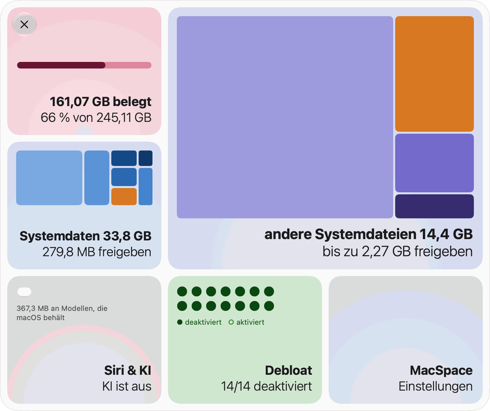
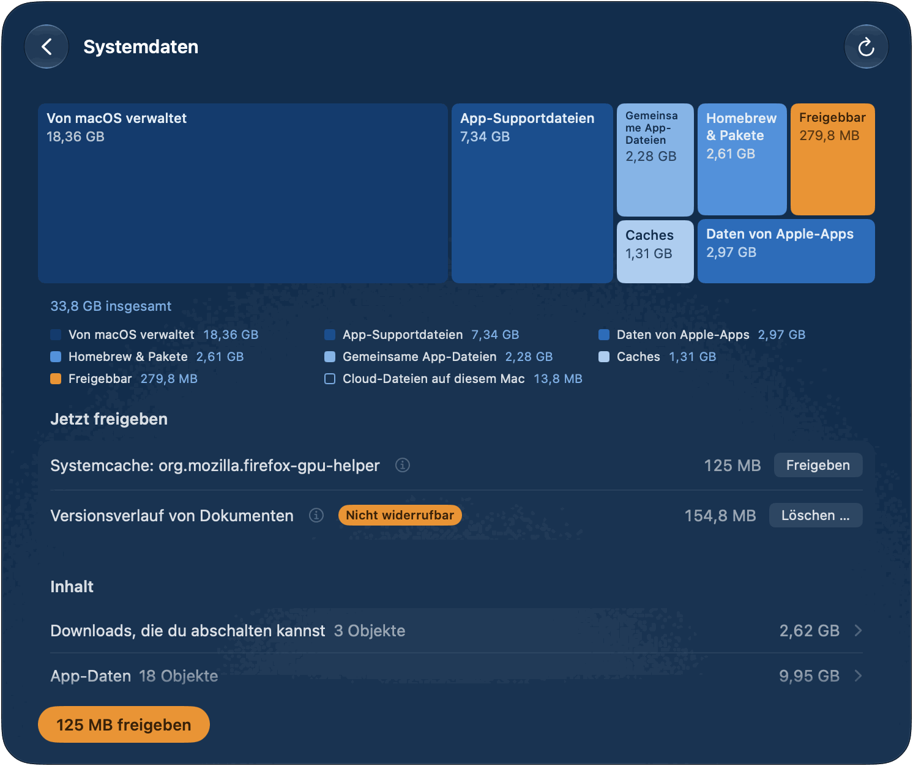
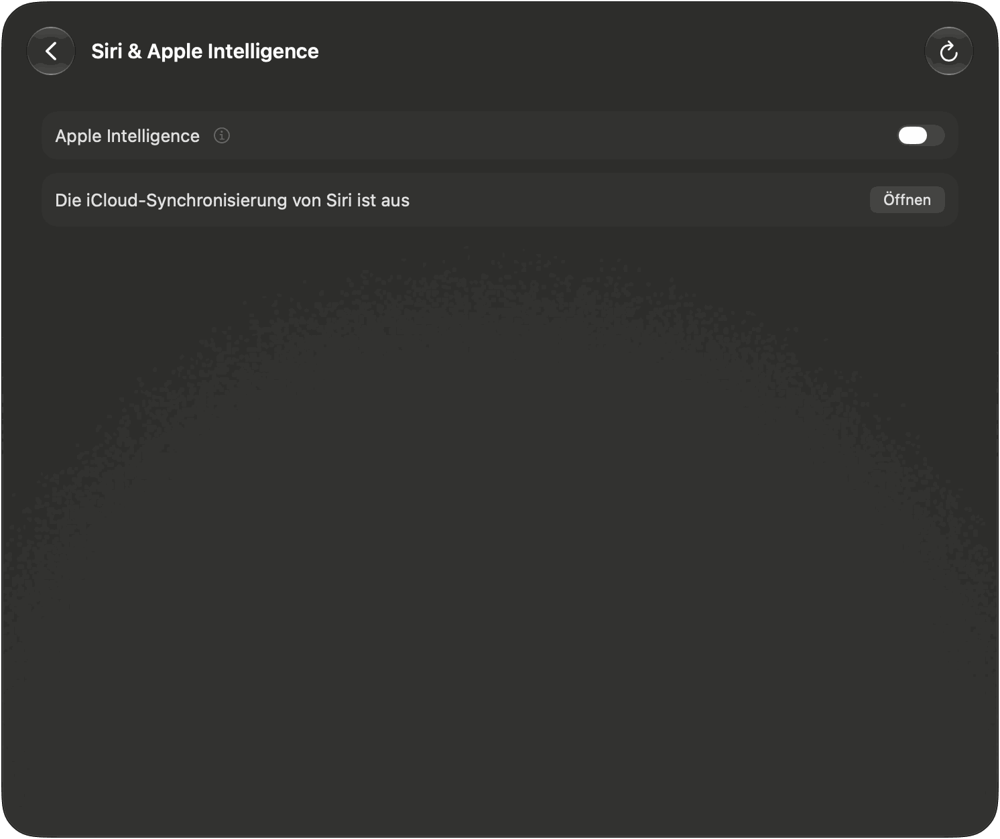
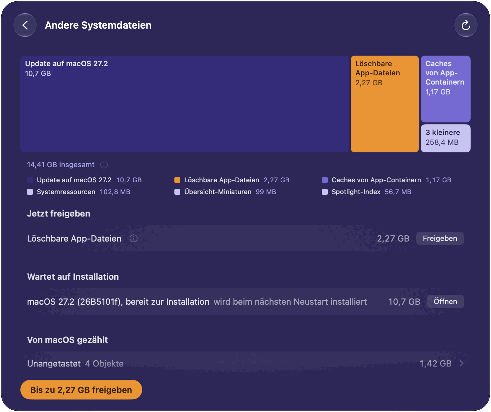
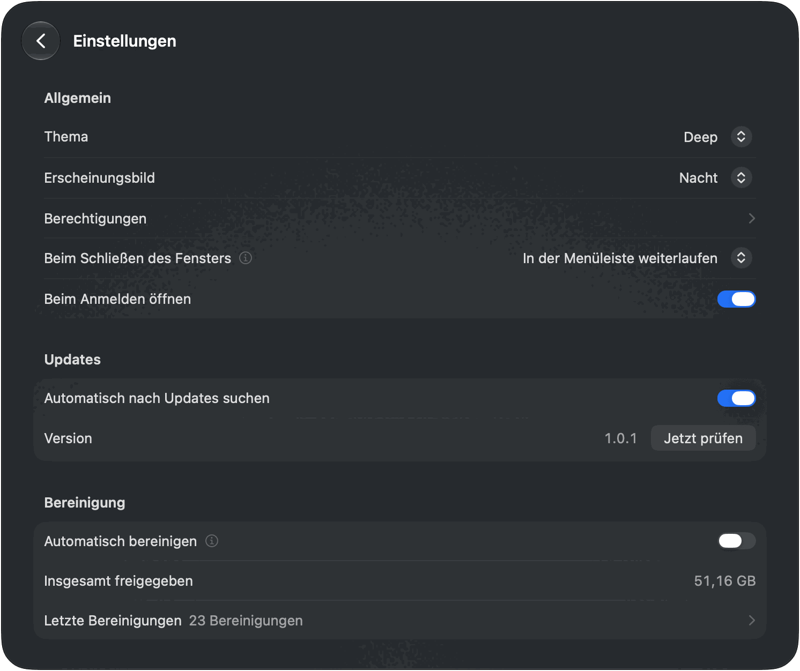

[English](README.md) · [Português](README.pt-BR.md) · [Español](README.es.md) · [Français](README.fr.md) · **Deutsch**

# MacSpace

**Eine Bereinigungs-App für „Systemdaten“ und Apple Intelligence unter macOS.**

[](https://github.com/1architect/macspace-releases/actions/workflows/ci.yml)
[](https://github.com/1architect/macspace-releases/releases/latest)
[](LICENSE)


MacSpace zeigt, was „Systemdaten“ füllt, und gibt frei, was gefahrlos gelöscht werden kann. Es
schaltet Apple Intelligence aus und löscht danach die Modelle, die macOS auf dem Speicher
behält. Es gibt Dateien frei, die Apps als löschbar markiert haben, und es kann die Analyse und
die Datensammlung im Hintergrund ausschalten, die macOS dich steuern lässt. Es ist kostenlos und
Open Source und **erfasst keine Daten über dich**.

[**MacSpace herunterladen**](#installation) ·
[Datenschutzerklärung](PRIVACY.de.md) ·
[Sicherheit](SECURITY.de.md) ·
[Änderungsprotokoll](CHANGELOG.md) (auf Englisch)

<p align="center">
  <picture>
    <source media="(prefers-color-scheme: dark)" srcset="Docs/Screenshots/de/Home-Dark.png">
    
  </picture>
</p>

---

## Was MacSpace kann

MacSpace hat vier Module. Jedes hat eine Kachel auf der Startseite und eine eigene Seite. Klicke
auf eine Kachel, um ihre Seite zu öffnen. **Zurück** geht eine Ebene nach oben. Du kannst jedes
Modul in den Einstellungen ausschalten.

**Systemdaten.** „Systemdaten“ ist der Teil des Speichers, den die Systemeinstellungen nicht
aufschlüsseln. MacSpace berechnet ihn so wie die Systemeinstellungen (belegter Speicher abzüglich
macOS und jeder anderen Kategorie), sodass der Wert nahe an dem liegt, den du dort siehst. Danach
schlüsselt es ihn auf: Caches, Protokolle, Berichte, Systemressourcen, App-Daten, Versionsverlauf
von Dokumenten. Was es nicht benennen kann, erscheint als **Nicht erkannt**. Es wird nie
ausgelassen.

Die Hauptschaltfläche, **Freigeben** mit einer Größe, löscht, was gefahrlos gelöscht werden kann:
Caches von Apps, die geschlossen sind, Diagnose- und Absturzberichte, die älter als 7 Tage sind,
und ungenutzte Systemressourcen. Unter **Jetzt freigeben** hat jedes Objekt eine eigene
Schaltfläche. Zwei Objekte stehen für sich, weil sie mehr Vorsicht verlangen: **Versionsverlauf
von Dokumenten** (frühere Versionen deiner Dokumente; die Dokumente bleiben) und **Übrige
macOS-Update-Dateien** (Dateien eines bereits installierten Updates). Bei allem, was zu macOS oder
zu anderen Apps gehört, sagt MacSpace, was es ist und was du von Hand tun kannst.

<p align="center">
  
</p>

**Siri & Apple Intelligence.** Ein Schalter, **Apple Intelligence**, auf der Seite und auf der
Kachel. Ist er ausgeschaltet, stellt MacSpace Siri auf eine andere Sprache als die deines Macs.
So entscheidet macOS, dass Apple Intelligence nicht verfügbar ist. Danach löscht MacSpace die
Modelle, die macOS auf dem Speicher behält; das können etwa 12 GB sein. Schaltest du ihn wieder
ein, stellt MacSpace deine Siri-Sprache und deine Siri-Stimme wieder her. Bei aktiver
iCloud-Synchronisierung von Siri erreicht die Sprachänderung auch dein iPhone und iPad. Die Seite
weist darauf hin und zeigt, wie du die Synchronisierung ausschaltest. Sie nennt außerdem andere
Accounts, bei denen Apple Intelligence an bleibt, weil alle Accounts die Modelle teilen. Eine
optionale Prüfung, **Prüfen, dass Apple Intelligence aus bleibt** in den Einstellungen, meldet
dir, wenn macOS es wieder einschaltet. In einer virtuellen Maschine bietet macOS Apple
Intelligence nicht an, daher sagt die Seite nur das.

<p align="center">
  
</p>

**Andere Systemdateien.** Speicher außerhalb von „Systemdaten“, den macOS als löschbar zählt.
macOS gibt ihn frei, wenn der Speicher fast voll ist. **Bis zu … freigeben** bittet macOS, das
jetzt zu tun. Die Größe ist eine Schätzung von macOS, deshalb steht dort „bis zu“. Kopien von
Cloud-Dateien auf diesem Mac (OneDrive, iCloud Drive und andere Cloud-Ordner) haben eine eigene
Zeile und eine eigene Schaltfläche, **Downloads entfernen**. Die Dateien bleiben in der Cloud und
werden beim Öffnen erneut geladen. Ein macOS-Update, das zur Installation bereit ist, steht unter
**Wartet auf Installation**. MacSpace löscht es nicht.

<p align="center">
  
</p>

**Debloat.** Vierzehn Schalter für Analyse, Werbung und Datensammlung im Hintergrund, die macOS
dich steuern lässt. Jeder Schalter heißt **… deaktivieren**: Ist er an, hat MacSpace diese
Funktion ausgeschaltet. **Alle deaktivieren** schaltet alles aus, was noch an ist. **Alle
aktivieren** stellt wieder her, was MacSpace geändert hat, anhand der Einstellungen, die es
zuvor gesichert hat. Solange MacSpace läuft, prüft es alle 15 Minuten und schaltet alles erneut
aus, was macOS wieder eingeschaltet hat (Richtlinien ausgenommen), und kann dir dazu eine
Mitteilung zeigen.

| Schalter | Was er bewirkt | Wirksam |
|---|---|---|
| Analysedaten mit Apple teilen | Sendet keine Nutzungs- und Absturzdaten mehr an Apple und App-Entwickler. | Sofort |
| Siri & Diktat verbessern | Teilt keine Aufnahmen von Siri und Diktat mehr mit Apple. | Sofort |
| Diktat und Übersetzung auf Apple-Servern | Diktat und Übersetzung bleiben auf diesem Mac. Sprachen ohne Modell auf dem Gerät funktionieren nicht mehr. | Nach erneutem Öffnen der Apps |
| Personalisierte Werbung | Apple wählt Werbung nicht mehr nach deinen Aktivitäten aus. | Nach erneutem Öffnen der Apps |
| Werbe-ID | Apps können dich nicht über die Werbe-ID tracken oder danach fragen. | Nach erneutem Öffnen der Apps |
| Siri AI | Deaktiviert Siri AI. Spotlight kehrt zur klassischen Suche zurück. | Nach einem Neustart |
| Visuelle Intelligenz | Deaktiviert Visuelle Intelligenz. Visuelles Nachschlagen funktioniert dann eventuell auch nicht mehr. | Nach einem Neustart |
| Indizierung für generative Suche | Verhindert, dass Apple Intelligence Mail und deine persönlichen Daten indiziert. | Nach einem Neustart |
| Apple Intelligence-Funktionen | Deaktiviert Schreibtools, Genmoji, Image Playground, Zusammenfassungen, intelligente Antworten und ChatGPT. | Nach erneutem Öffnen der Apps |
| Internetergebnisse in Spotlight | Spotlight sendet deine Suchen nicht mehr an Apple. Keine Webergebnisse mehr in Spotlight. | Nach erneutem Öffnen der Apps |
| Hänger-Aufzeichnung (tailspin) | Verhindert, dass macOS ständig Aktivität für Hängeberichte aufzeichnet. Gibt etwa 100 MB Arbeitsspeicher frei. | Sofort |
| Absturzbericht-Dialog | Keine Dialoge „unerwartet beendet“ mehr. | Nach einem Neustart |
| Game Center | Deaktiviert Game Center. | Nach dem Abmelden |
| Apple News | Blendet Apple News und seine Widgets aus. | Nach dem Abmelden |

Sechs davon sind Richtlinien. Beim Deaktivieren musst du einmal ein Profil in den
Systemeinstellungen genehmigen (siehe [Berechtigungen](#erster-start-und-berechtigungen)). In
einer Betaversion von macOS ist auch der Schalter für Analysedaten eine Richtlinie, weil macOS
die Einstellung dort ignoriert.

<p align="center">
  
</p>

**Außerdem in MacSpace.** **Automatisch bereinigen** (Einstellungen, aus, bis du es einschaltest)
gibt frei, was die Module ohne Rückfrage freigeben können, täglich, alle 3 Tage oder
wöchentlich, solange MacSpace läuft. Debloat nimmt daran nicht teil, und der Versionsverlauf
wird nie gelöscht. **Letzte Bereinigungen** listet auf, was jede freigegeben hat. MacSpace zeigt
dir eine Mitteilung, wenn die automatische Bereinigung mindestens 100 MB freigibt, wenn eine
Aktion, die eine Weile gedauert hat, endet, während MacSpace nicht im Vordergrund ist, und wenn
der Speicher fast voll ist (höchstens einmal am Tag). Jede Mitteilung lässt sich ausschalten.
**Beim Schließen des Fensters** kann sich MacSpace beenden, in der Menüleiste weiterlaufen
(Standard) oder unsichtbar im Hintergrund weiterlaufen. Mit Rechtsklick auf das Symbol in der
Menüleiste öffnet sich ein Menü mit jedem Modul, **Einstellungen …**, **Panel öffnen** und
**MacSpace beenden**. MacSpace spricht Englisch, Portugiesisch (Brasilien), Französisch,
Spanisch und Deutsch und folgt deiner Systemsprache.

---

## Installation

### Homebrew (offiziell)

```bash
brew install --cask 1architect/macspace/macspace
```

### Direkter Download (DMG)

Lade die neueste `MacSpace-x.y.z.dmg` von
[Releases](https://github.com/1architect/macspace-releases/releases/latest) herunter, öffne sie
und ziehe **MacSpace** in deinen Ordner „Programme“. Öffne MacSpace von dort. Es muss aus einem
Ordner „Programme“ laufen, weil sich das Hilfsprogramm nur von dort registriert.

Zu jeder Version gehört außerdem `MacSpace-x.y.z.dmg.sha256`. Lege zum Prüfen deines Downloads
beide Dateien in einen Ordner und führe aus:

```bash
shasum -a 256 -c MacSpace-x.y.z.dmg.sha256
```

Es gibt `MacSpace-x.y.z.dmg: OK` aus. MacSpace ist mit einer Developer ID signiert und von Apple
notarisiert. [Sicherheit](SECURITY.de.md) zeigt, wie du auch das prüfst.

### Voraussetzungen

macOS 27 oder neuer, auf Apple Silicon. macOS 27 läuft nur auf Apple Silicon, und MacSpace ist
nur dafür gebaut.

### Updates und Einstellungen

MacSpace aktualisiert sich mit [Sparkle](https://sparkle-project.org). Wähle **Nach Updates
suchen …** im Menü „MacSpace“ oder **Jetzt prüfen** unter **Einstellungen > Updates**. **Automatisch nach Updates suchen** an derselben Stelle lässt MacSpace etwa einmal am
Tag nachsehen, solange es läuft. Bis du es einschaltest oder die Frage beantwortest, die Sparkle
ab dem zweiten Start einmal stellt, sucht MacSpace nicht von selbst. Jedes Update ist signiert,
und Sparkle prüft die Signatur, bevor es etwas installiert. Mit Homebrew kannst du auch
`brew upgrade --cask macspace` ausführen (füge `--greedy` hinzu, wenn Homebrew es überspringt,
weil sich MacSpace selbst aktualisiert).

<p align="center">
  
</p>

---

## Erster Start und Berechtigungen

Bei einer Neuinstallation beginnt MacSpace mit dem, was es braucht, Bildschirm für Bildschirm:
**Festplattenvollzugriff erlauben**, **Hilfsprogramm genehmigen**, **Mitteilungen erhalten**,
dann **Alles bereit**. Jeder Schritt kann warten (**Später**), und Schritte, die du schon
erledigt hast, werden übersprungen. Du findest sie wieder unter **Einstellungen >
Berechtigungen**.

<p align="center">
  
</p>

| Berechtigung | Wo du sie erteilst | Wozu MacSpace sie braucht | Module |
|---|---|---|---|
| Festplattenvollzugriff | Systemeinstellungen > Datenschutz & Sicherheit > Festplattenvollzugriff | Um alles auf dem Speicher zu messen und den Zustand von Apple Intelligence zu lesen. | Systemdaten, Siri & Apple Intelligence |
| Privilegiertes Hilfsprogramm | Systemeinstellungen > Allgemein > Anmeldeobjekte & Erweiterungen, unter **Im Hintergrund erlauben** | Ein kleines Programm, das die wenigen Aufgaben erledigt, die einen Administrator erfordern (siehe unten). | Systemdaten, Siri & Apple Intelligence, Debloat |
| Mitteilungen | macOS fragt beim ersten Mal | Um dir zu sagen, wenn etwas fertig ist oder dich braucht. | Alle |
| Konfigurationsprofil | Systemeinstellungen > Allgemein > Geräteverwaltung | Wendet die Debloat-Richtlinien an, die du einschaltest. Nur für die sechs Richtlinien nötig. | Debloat |

„Andere Systemdateien“ braucht keine eigene Berechtigung. macOS übernimmt jede Autorisierung,
daher sieht MacSpace nie dein Passwort. Fehlt eine Berechtigung, leistet ein Modul weniger und
sagt, was fehlt.

Das Hilfsprogramm ist ein Launch-Daemon, `com.macspace.helper`. Es führt nur benannte Operationen
aus, die fest in ihm eingebaut sind, ein Aufrufer kann ihm keine Befehle schicken, und es
akzeptiert nur Clients, die vom selben Entwicklerteam wie MacSpace signiert sind. Unter anderem
kann es die Größe von Systemordnern messen (nie die eines Benutzerordners), den Versionsverlauf
von Dokumenten und die übrigen Dateien eines installierten macOS-Updates löschen, die
Debloat-Schalter ändern, die einen Administrator erfordern, und das MacSpace-Profil entfernen.
[Sicherheit](SECURITY.de.md) enthält die vollständige Liste.

---

## Sicherheit

**Was es löscht.** Nur, was es benennen kann. Nichts landet im Papierkorb.

- Caches, die Apps neu aufbauen: die Caches im Systemcache-Ordner pro Benutzer
  (`/var/folders/…/C`) und die Web-Caches (`Cache`, `Code Cache`, `GPUCache`), die Chromium- und
  Electron-Apps in `~/Library/Application Support` ablegen. Nur solange die App, der sie
  gehören, geschlossen ist. `~/Library/Caches` wird aufgelistet, nicht bereinigt.
- Diagnose- und Absturzberichte, die älter als 7 Tage sind, in `/Library/Logs/DiagnosticReports`
  und `~/Library/Logs/DiagnosticReports`.
- Ungenutzte Systemressourcen, Apple Intelligence-Modelle, die macOS freigegeben hat, und
  Dateien, die Apps als löschbar markiert haben. MacSpace fordert sie beim Bereinigungsdienst von
  macOS an, den macOS selbst ausführt, wenn der Speicher fast voll ist. Sie werden bei Bedarf
  erneut geladen.
- Nur wenn du die zugehörige Schaltfläche drückst: der Versionsverlauf von Dokumenten, die
  übrigen Dateien eines installierten macOS-Updates und die lokalen Kopien von Cloud-Dateien.

**Was es nie antastet.** MacSpace misst, wie viel Speicher deine Dokumente, Fotos, Mail und
Nachrichten belegen. Es liest nicht, was darin steht, und löscht sie nie. Es listet große Objekte
wie unvollständige Downloads, macOS-Wiederherstellungsimages und virtuelle Maschinen auf und
überlässt sie dir. Daten anderer Apps lässt es in Ruhe und sagt, wie du sie in der App selbst
bereinigst. Es schaltet den Systemintegritätsschutz nicht aus und ändert das versiegelte
Systemvolume nicht.

**Was zuerst nachfragt.** Jede Schaltfläche, die mehr als die Caches einer App löscht, fragt nach
einer Bestätigung. **Löschen …** bei **Versionsverlauf von Dokumenten** trägt die Kennzeichnung
**Nicht widerrufbar**. Der Schalter **Apple Intelligence** und die einzelnen Debloat-Schalter
wirken sofort und gehen von selbst zurück, wenn die Änderung scheitert.

**Was du rückgängig machen kannst.** Debloat: Schalte eine Funktion wieder ein oder klicke auf
**Alle aktivieren**. MacSpace stellt die Einstellungen wieder her, die es vor der Änderung
gesichert hat. Apple Intelligence: Schalte es wieder ein. MacSpace stellt deine Siri-Sprache und
deine Siri-Stimme wieder her, und macOS lädt die Modelle möglicherweise erneut. Gelöschte Caches
werden neu aufgebaut. Gelöschte Berichte und der gelöschte Versionsverlauf kommen nicht zurück.

**Virtuelle Maschinen.** In einer virtuellen Maschine tut **Siri & Apple Intelligence** nichts
und sagt, warum. Debloat listet dort weiterhin Schalter auf, die in einer virtuellen Maschine
nicht wirken können.

Wie sich macOS verhält, mit Messwerten, steht in [Docs/Research.md](Docs/Research.md) (auf
Englisch).

---

## Datenschutz

MacSpace hat keine Analyse, keine Telemetrie, keine Absturzberichte und keinen Account. Was es
misst, dein Bereinigungsverlauf und deine Einstellungen bleiben auf deinem Mac, unter
`~/Library/Application Support/MacSpace/`. Das Netzwerk wird für eine einzige Sache genutzt:
Updates. MacSpace liest einen kleinen Update-Feed auf GitHub und lädt, wenn du ein Update
annimmst, es von GitHub herunter. Es sendet kein Systemprofil und keine Kennung. Jede Datei, die
es schreibt, und alles, was es liest, steht in der [Datenschutzerklärung](PRIVACY.de.md) und in
der [Sicherheitsrichtlinie](SECURITY.de.md).

---

## Deinstallation

Es gibt kein Deinstallationsprogramm. So entfernst du MacSpace und alles, was es geändert hat:

1. **Mache rückgängig, was MacSpace geändert hat.** Klicke in **Debloat** auf **Alle
   aktivieren**. Das entfernt auch die Überschreibungen, die Debloat außerhalb der eigenen Ordner
   von MacSpace geschrieben hat und die bestehen bleiben, wenn du nur die App löschst. Ist ein
   Neustart nötig, sagt die Seite es. Hast du Apple Intelligence ausgeschaltet und möchtest es
   zurück, schalte es in **Siri & Apple Intelligence** ein.
2. **Entferne das Profil**, falls noch eines installiert ist: Wähle in Systemeinstellungen >
   Allgemein > Geräteverwaltung **MacSpace: policies** (Kennung `com.macspace.policies`) aus und
   entferne es.
3. **Beende MacSpace** (**MacSpace beenden** im Menü „MacSpace“ oder im Menü seines Symbols in der
   Menüleiste). Entferne das Hilfsprogramm: Schalte MacSpace unter Systemeinstellungen >
   Allgemein > Anmeldeobjekte & Erweiterungen aus oder führe dies aus, bevor du die App löschst:
   ```bash
   /Applications/MacSpace.app/Contents/MacOS/MacSpaceCli helper --unregister
   ```
4. **Entferne die App:** `brew uninstall --cask macspace` (füge `--zap` hinzu, um auch ihre Daten
   und Einstellungen zu entfernen) oder ziehe **MacSpace** aus „Programme“ in den Papierkorb.
5. **Entferne ihre Daten und Einstellungen:**
   ```bash
   rm -rf ~/Library/Application\ Support/MacSpace ~/Library/Logs/MacSpace ~/Library/Caches/com.macspace.app
   defaults delete com.macspace.app
   sudo rm -rf /Library/Application\ Support/MacSpace
   ```
   Die letzte Zeile ist nur nötig, wenn du Debloat genutzt oder übrige Apple
   Intelligence-Abonnements entfernt hast. Führe sie nach Schritt 1 aus: Dieser Ordner enthält
   die Originale, die MacSpace wiederherstellt.
6. **Entferne den Festplattenvollzugriff:** Wähle in Systemeinstellungen > Datenschutz &
   Sicherheit > Festplattenvollzugriff MacSpace aus und klicke auf die Minus-Schaltfläche.

---

## Aus dem Quellcode bauen

Der Quellcode ist dieses Repository. [Docs/Handoff.md](Docs/Handoff.md) (auf Englisch) erklärt,
wie es aufgebaut ist. Du brauchst macOS 27 und Xcode 27.

```bash
export DEVELOPER_DIR=/Applications/Xcode-beta.app/Contents/Developer
swift test
INSTALL=1 Scripts/Assemble.sh
```

Der letzte Befehl baut `Build/MacSpace.app` und kopiert es nach `/Applications`. Ohne ein
Developer-ID-Zertifikat wird der Build ad hoc signiert und nicht notarisiert, und macOS fragt
nach jedem Build erneut nach Festplattenvollzugriff. Ein Build, den du selbst erstellst, hat
keinen Update-Schlüssel und sucht daher nie nach Updates.

---

## Support und Mitwirken

**dev@giomantovani.com.br**

Fehler, Ideen und falsche Übersetzungen: [GitHub Issues](https://github.com/1architect/macspace-releases/issues).
Sicherheitsprobleme: niemals in einem öffentlichen Issue, siehe [SECURITY.de.md](SECURITY.de.md).
Wenn du mitwirken möchtest, lies [CONTRIBUTING.md](CONTRIBUTING.md) (auf Englisch). Alle, die
mitmachen, befolgen den [Verhaltenskodex](CODE_OF_CONDUCT.md) (auf Englisch). Änderungen stehen
im [Änderungsprotokoll](CHANGELOG.md).

---

## Lizenz

MacSpace ist freie Software unter der MIT-Lizenz. Copyright (c) 2026 1architect. Siehe
[LICENSE](LICENSE) (auf Englisch). Verbindlich ist der englische Text. Die Übersetzungen in
`LICENSE.<Sprache>.md` dienen nur der Orientierung. Hinweise zu Drittsoftware stehen in
[NOTICE](NOTICE) (auf Englisch).

MacSpace steht in keiner Verbindung zu Apple. Apple Intelligence, Siri und macOS sind Marken der
Apple Inc.
