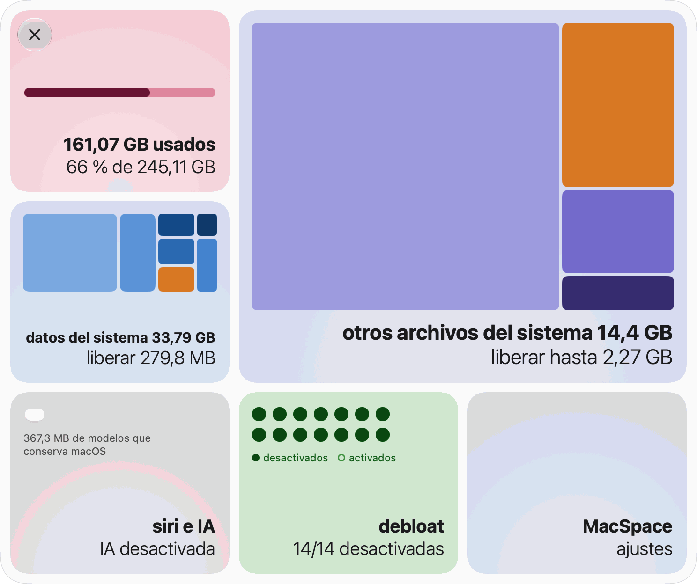
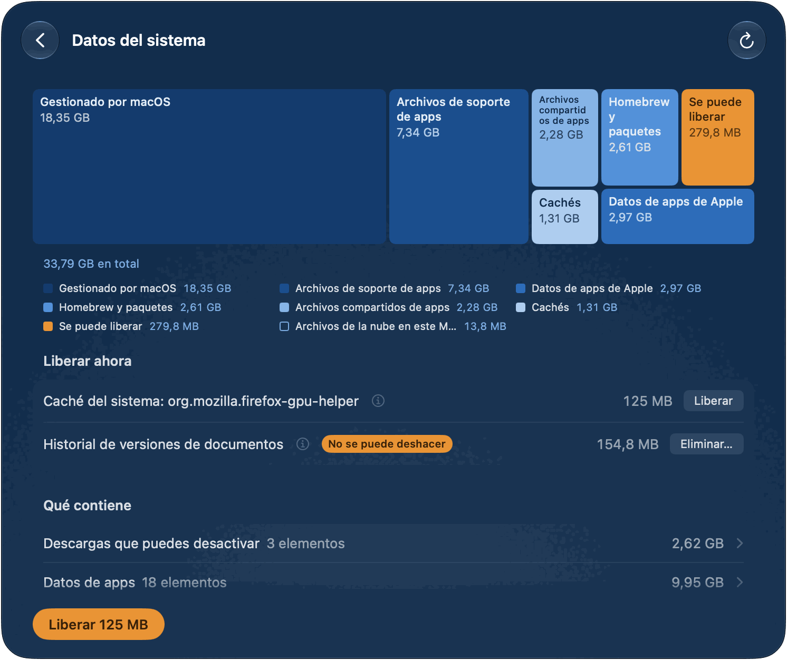
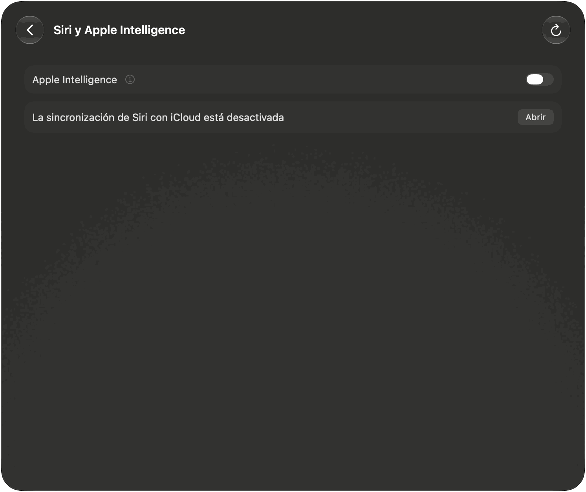
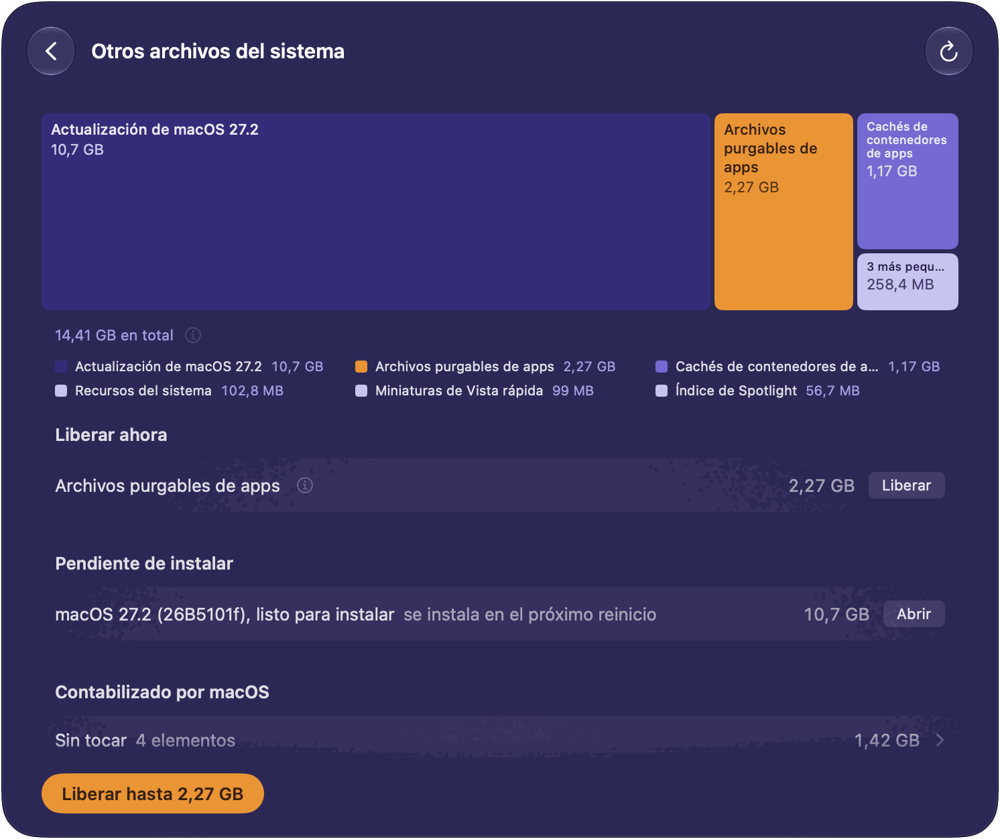
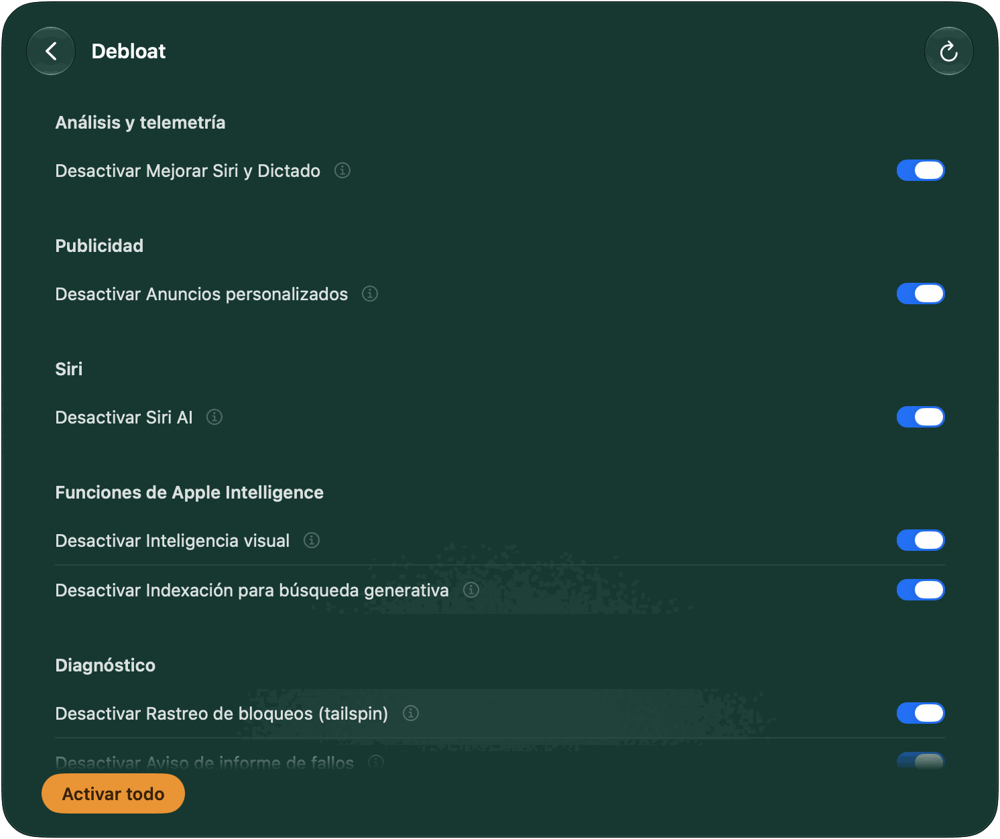
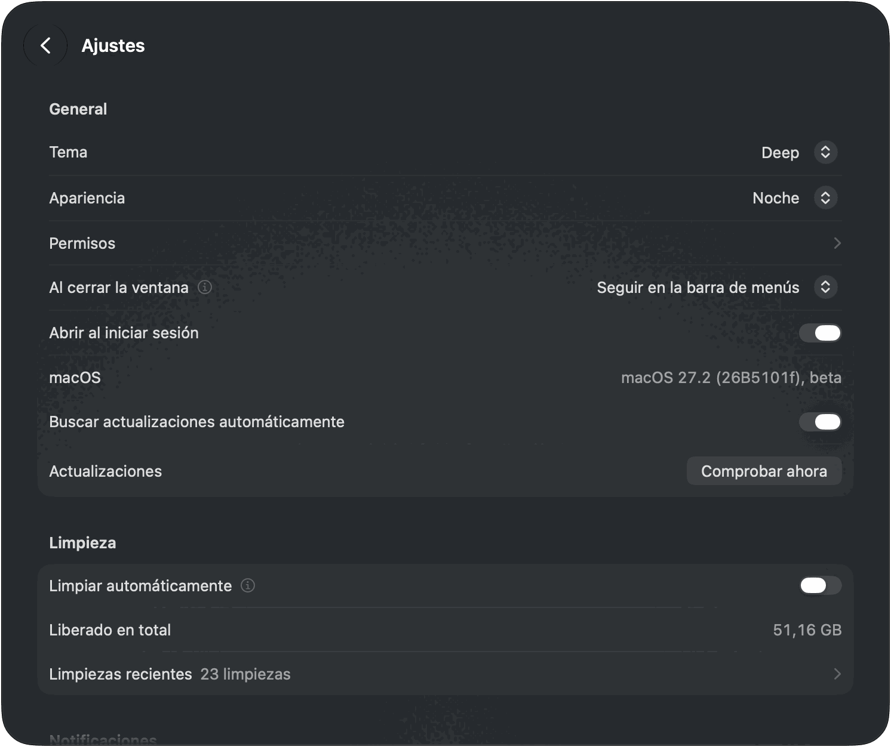

[English](README.md) · [Português](README.pt-BR.md) · **Español** · [Français](README.fr.md) · [Deutsch](README.de.md)

# MacSpace

**Un limpiador de Datos del sistema y de Apple Intelligence para macOS.**

[](https://github.com/1architect/macspace-releases/actions/workflows/ci.yml)
[](https://github.com/1architect/macspace-releases/releases/latest)
[](LICENSE)


MacSpace muestra qué ocupa Datos del sistema y libera lo que se puede eliminar sin riesgo.
Desactiva Apple Intelligence y elimina después los modelos que macOS conserva en el disco.
Libera los archivos que las apps marcaron como purgables, y puede desactivar los análisis y la
recogida de datos en segundo plano que macOS te deja controlar. Es gratis y de código abierto, y
**no recoge ningún dato sobre ti**.

[**Descargar MacSpace**](#instalar) ·
[Política de Privacidad](PRIVACY.es.md) ·
[Seguridad](SECURITY.es.md) ·
[Registro de cambios](CHANGELOG.md) (en inglés)

<p align="center">
  <picture>
    <source media="(prefers-color-scheme: dark)" srcset="Docs/Screenshots/es/Home-Dark.png">
    
  </picture>
</p>

---

## Qué hace

MacSpace tiene cuatro módulos. Cada uno tiene un mosaico en la página de inicio y una página
propia. Haz clic en un mosaico para abrir su página. **Atrás** sube un nivel. Puedes desactivar
cualquier módulo en Ajustes.

**Datos del sistema.** Datos del sistema es la parte del disco que Ajustes del Sistema no
explica. MacSpace la calcula igual que Ajustes del Sistema (espacio usado, menos macOS y todas
las demás categorías), así que la cifra se acerca a la que ves allí. Después la desglosa:
cachés, registros, informes, recursos del sistema, datos de apps, historial de versiones de
documentos. Lo que no puede nombrar aparece como **Sin identificar**. Nunca se deja fuera.

El botón principal, **Liberar** con un tamaño, elimina lo que se puede eliminar sin riesgo:
cachés de apps que están cerradas, informes de diagnóstico y de fallos con más de 7 días, y
recursos del sistema sin usar. En **Liberar ahora**, cada elemento tiene su propio botón. Dos
elementos van aparte porque requieren más cuidado: **Historial de versiones de documentos**
(versiones anteriores de tus documentos; los documentos se conservan) y **Archivos sobrantes de
actualización de macOS** (archivos de una actualización que ya está instalada). Para todo lo que
pertenece a macOS o a otras apps, MacSpace dice qué es y qué hacer a mano.

<p align="center">
  
</p>

**Siri y Apple Intelligence.** Un solo interruptor, **Apple Intelligence**, en la página y en el
mosaico. Al desactivarlo, MacSpace pone Siri en un idioma distinto al de tu Mac. Así es como
macOS decide que Apple Intelligence no está disponible. Después MacSpace elimina los modelos que
macOS conserva en el disco, que pueden ocupar unos 12 GB. Si lo activas de nuevo, MacSpace
restaura tu idioma y tu voz de Siri. Con la sincronización de Siri con iCloud activada, el
cambio de idioma también llega a tu iPhone y a tu iPad. La página lo avisa y muestra cómo
desactivar la sincronización. También nombra otras cuentas que mantienen Apple Intelligence
activado, porque los modelos los comparten todas las cuentas. Una comprobación opcional,
**Comprobar que Apple Intelligence siga desactivado** en Ajustes, te avisa si macOS lo vuelve a
activar. En una máquina virtual macOS no ofrece Apple Intelligence, así que la página solo dice
eso.

<p align="center">
  
</p>

**Otros archivos del sistema.** Espacio fuera de Datos del sistema que macOS cuenta como
purgable. macOS lo libera cuando el disco está casi lleno. **Liberar hasta** le pide que lo haga
ahora. La cifra es una estimación de macOS, por eso dice «hasta». Las copias de archivos de la
nube guardadas en este Mac (OneDrive, iCloud Drive y otras carpetas de la nube) tienen una fila
y un botón propios, **Eliminar descargas**. Los archivos se quedan en la nube y se vuelven a
descargar al abrirlos. Una actualización de macOS lista para instalar aparece en **Pendiente de
instalar**. MacSpace no la elimina.

<p align="center">
  
</p>

**Debloat.** Catorce interruptores para los análisis, la publicidad y la recogida de datos en
segundo plano que macOS te deja controlar. Cada interruptor se llama **Desactivar …**: activado
significa que MacSpace desactivó esa función. **Desactivar todo** desactiva todo lo que sigue
activado. **Activar todo** restaura lo que MacSpace cambió, con los ajustes que guardó antes.
Mientras MacSpace está abierto, lo comprueba cada 15 minutos y vuelve a desactivar todo lo que
macOS haya activado de nuevo (salvo las políticas), y puede avisarte cuando lo hace.

| Interruptor | Qué hace | Surte efecto después de |
|---|---|---|
| Compartir análisis con Apple | Deja de enviar datos de uso y de fallos a Apple y a los desarrolladores. | Nada |
| Mejorar Siri y Dictado | Deja de compartir las grabaciones de Siri y del dictado con Apple. | Nada |
| Dictado y traducción en los servidores de Apple | El dictado y la traducción se quedan en este Mac. Los idiomas sin modelo en el dispositivo dejan de funcionar. | Volver a abrir las apps |
| Anuncios personalizados | Apple deja de elegir anuncios según lo que haces. | Volver a abrir las apps |
| Identificador de publicidad | Las apps no pueden rastrearte con el identificador de publicidad ni pedírtelo. | Volver a abrir las apps |
| Siri AI | Desactiva Siri AI. Spotlight vuelve a la búsqueda clásica. | Un reinicio |
| Inteligencia visual | Desactiva la inteligencia visual. Búsqueda visual también puede dejar de funcionar. | Un reinicio |
| Indexación para búsqueda generativa | Impide que Apple Intelligence indexe tu Mail y tus datos personales. | Un reinicio |
| Funciones de Apple Intelligence | Desactiva Herramientas de Escritura, Genmoji, Image Playground, los resúmenes, las respuestas inteligentes y ChatGPT. | Volver a abrir las apps |
| Resultados de internet en Spotlight | Spotlight deja de enviar tus búsquedas a Apple. Sin resultados web en Spotlight. | Volver a abrir las apps |
| Rastreo de bloqueos (tailspin) | Impide que macOS grabe la actividad sin parar para los informes de bloqueos. Libera unos 100 MB de memoria. | Nada |
| Aviso de informe de fallos | Se acabaron los avisos de «se ha cerrado inesperadamente». | Un reinicio |
| Game Center | Desactiva Game Center. | Cerrar sesión |
| Apple News | Oculta Apple News y sus widgets. | Cerrar sesión |

Seis de ellos son políticas. Desactivar una te pide aprobar un perfil en Ajustes del Sistema una
vez (consulta [Permisos](#primer-arranque-y-permisos)). En una beta de macOS, el interruptor de
análisis también es una política, porque macOS ignora ahí el ajuste.

<p align="center">
  
</p>

**También en MacSpace.** **Limpiar automáticamente** (en Ajustes, desactivada hasta que la
actives) libera sin preguntar lo que los módulos pueden liberar, cada día, cada 3 días o cada
semana, mientras MacSpace está abierto. Debloat no participa, y el historial de versiones nunca
se elimina. **Limpiezas recientes** enumera lo que liberó cada una. MacSpace te avisa cuando la
limpieza automática libera al menos 100 MB, cuando termina una acción que tardó un rato mientras
MacSpace no está en primer plano, y cuando el disco está casi lleno (como máximo una vez al
día). Cada aviso se puede desactivar. **Al cerrar la ventana**, MacSpace puede salir, seguir en
la barra de menús (lo predeterminado) o seguir en segundo plano, fuera de la vista. Haz clic
derecho en el icono de la barra de menús para ver un menú con cada módulo, **Ajustes…**,
**Abrir panel** y **Salir de MacSpace**. MacSpace está disponible en inglés, portugués (Brasil),
francés, español y alemán, y sigue el idioma del sistema.

---

## Instalar

### Homebrew (oficial)

```bash
brew install --cask 1architect/macspace/macspace
```

### Descarga directa (DMG)

Descarga el `MacSpace-x.y.z.dmg` más reciente desde
[Releases](https://github.com/1architect/macspace-releases/releases/latest), ábrelo y arrastra
**MacSpace** a tu carpeta Aplicaciones. Abre MacSpace desde ahí. Debe ejecutarse desde una
carpeta Aplicaciones, porque el asistente solo se registra desde allí.

Cada versión incluye también `MacSpace-x.y.z.dmg.sha256`. Para comprobar tu descarga, pon los dos
archivos en una misma carpeta y ejecuta:

```bash
shasum -a 256 -c MacSpace-x.y.z.dmg.sha256
```

Debe mostrar `MacSpace-x.y.z.dmg: OK`. MacSpace está firmado con un Developer ID y notarizado por
Apple. [Seguridad](SECURITY.es.md) muestra cómo comprobarlo también.

### Requisitos

macOS 27 o posterior, en Apple Silicon. macOS 27 solo funciona en Apple Silicon, y MacSpace está
compilado solo para él.

### Actualizaciones y ajustes

MacSpace se actualiza con [Sparkle](https://sparkle-project.org). Elige **Buscar
actualizaciones…** en el menú MacSpace, o **Comprobar ahora** en **Ajustes > Actualizaciones**. **Buscar actualizaciones automáticamente**, en el mismo sitio, deja que
MacSpace busque aproximadamente una vez al día mientras está abierto. Hasta que lo actives, o
respondas a la pregunta que Sparkle hace una vez a partir del segundo arranque, MacSpace no busca
por su cuenta. Cada actualización está firmada, y Sparkle comprueba la firma antes de instalar
nada. Con Homebrew, también puedes ejecutar `brew upgrade --cask macspace` (añade `--greedy` si
Homebrew la omite, porque MacSpace se actualiza solo).

<p align="center">
  
</p>

---

## Primer arranque y permisos

En una instalación nueva, MacSpace empieza con lo que necesita, una pantalla cada vez: **Permitir
acceso total al disco**, **Aprueba el asistente**, **Recibe avisos** y, por último, **Todo
listo**. Cada paso puede esperar (**Más tarde**), y los pasos que ya hiciste se omiten. Puedes
volver a ellos en **Ajustes > Permisos**.

<p align="center">
  
</p>

| Permiso | Dónde lo concedes | Por qué lo necesita MacSpace | Módulos |
|---|---|---|---|
| Acceso total al disco | Ajustes del Sistema > Privacidad y seguridad > Acceso total al disco | Para medir todo lo que hay en el disco y para leer el estado de Apple Intelligence. | Datos del sistema, Siri y Apple Intelligence |
| Asistente con privilegios | Ajustes del Sistema > General > Ítems de inicio y extensiones, en **Permitir en segundo plano** | Un pequeño programa que realiza las pocas tareas que requieren un administrador (ver abajo). | Datos del sistema, Siri y Apple Intelligence, Debloat |
| Notificaciones | macOS lo pide la primera vez | Para avisarte cuando algo ha terminado o te necesita. | Todos |
| Perfil de configuración | Ajustes del Sistema > General > Gestión de dispositivos | Aplica las políticas de Debloat que actives. Solo hace falta para las seis políticas. | Debloat |

Otros archivos del sistema no necesita ningún permiso propio. macOS gestiona cada autorización,
así que MacSpace nunca ve tu contraseña. Sin un permiso, un módulo hace menos y dice qué falta.

El asistente es un launch daemon, `com.macspace.helper`. Solo ejecuta operaciones con nombre que
lleva integradas, quien lo llame no puede enviarle comandos, y solo acepta clientes firmados por
el mismo equipo de desarrollo que MacSpace. Entre otras cosas, puede medir el tamaño de las
carpetas del sistema (nunca de una carpeta de inicio), eliminar el historial de versiones de
documentos y los archivos sobrantes de una actualización de macOS ya instalada, cambiar los
interruptores de Debloat que requieren un administrador y eliminar el perfil de MacSpace.
[Seguridad](SECURITY.es.md) tiene la lista completa.

---

## Uso seguro

**Qué elimina.** Solo lo que puede nombrar. Nada va a la Papelera.

- Cachés que las apps vuelven a crear: las cachés de la carpeta de caché del sistema de cada
  usuario (`/var/folders/…/C`) y las cachés web (`Cache`, `Code Cache`, `GPUCache`) que las apps
  de Chromium y Electron guardan en `~/Library/Application Support`. Solo mientras la app a la
  que pertenecen está cerrada. `~/Library/Caches` se muestra, pero no se limpia.
- Informes de diagnóstico y de fallos con más de 7 días, en `/Library/Logs/DiagnosticReports` y
  `~/Library/Logs/DiagnosticReports`.
- Recursos del sistema sin usar, modelos de Apple Intelligence que macOS ha liberado y archivos
  que las apps marcaron como purgables. MacSpace se los pide al propio servicio de purga de
  macOS, el que macOS ejecuta cuando el disco está casi lleno. Se vuelven a descargar si hacen
  falta.
- Solo cuando pulsas su propio botón: el historial de versiones de documentos, los archivos
  sobrantes de una actualización de macOS ya instalada y las copias locales de archivos de la
  nube.

**Qué no toca nunca.** MacSpace mide cuánto espacio ocupan tus documentos, Fotos, Mail y
Mensajes. No lee lo que contienen y nunca los elimina. Muestra elementos grandes, como descargas
sin terminar, imágenes de restauración de macOS y máquinas virtuales, y te los deja a ti. No toca
los datos de otras apps y dice cómo limpiarlos desde la propia app. No desactiva la Protección de
integridad del sistema ni modifica el volumen del sistema sellado.

**Qué pide confirmación antes.** Todo botón que elimina las cachés de más de una app pide
confirmación. **Eliminar…** en **Historial de versiones de documentos** lleva una etiqueta **No
se puede deshacer**. El interruptor **Apple Intelligence** y los interruptores sueltos de Debloat
actúan al instante, y vuelven solos atrás si el cambio falla.

**Qué se puede deshacer.** Debloat: vuelve a activar una función, o pulsa **Activar todo**.
MacSpace restaura los ajustes que guardó antes de cambiarlos. Apple Intelligence: actívalo de
nuevo. MacSpace restaura tu idioma y tu voz de Siri, y macOS puede volver a descargar los
modelos. Las cachés eliminadas se vuelven a crear. Los informes eliminados y el historial de
versiones no se recuperan.

**Máquinas virtuales.** En una máquina virtual, **Siri y Apple Intelligence** no hace nada y
dice por qué. Debloat sigue mostrando allí interruptores que no pueden surtir efecto en una
máquina virtual.

Cómo se comporta macOS, con mediciones, está en [Docs/Research.md](Docs/Research.md) (en inglés).

---

## Privacidad

MacSpace no tiene análisis de uso, ni telemetría, ni informes de fallos, ni cuentas. Lo que mide,
tu historial de limpiezas y tus ajustes se quedan en tu Mac, en
`~/Library/Application Support/MacSpace/`. La red se usa para una sola cosa: las actualizaciones.
MacSpace lee un pequeño feed de actualizaciones en GitHub y, si aceptas una actualización, la
descarga de GitHub. No envía ningún perfil del sistema ni ningún identificador. Todos los
archivos que escribe, y todo lo que lee, están en la [Política de Privacidad](PRIVACY.es.md) y en
la [Política de Seguridad](SECURITY.es.md).

---

## Desinstalar

No hay desinstalador. Para quitar MacSpace y todo lo que cambió:

1. **Deshaz lo que MacSpace cambió.** En **Debloat**, pulsa **Activar todo**. Esto también
   elimina las anulaciones que Debloat escribió fuera de las carpetas propias de MacSpace, que
   se quedan donde están si solo eliminas la app. Si hace falta reiniciar, la página lo dice. Si
   desactivaste Apple Intelligence y quieres recuperarlo, actívalo en **Siri y Apple
   Intelligence**.
2. **Elimina el perfil**, si aún hay uno instalado: en Ajustes del Sistema > General > Gestión de
   dispositivos, selecciona **MacSpace: policies** (identificador `com.macspace.policies`) y
   elimínalo.
3. **Sal de MacSpace** (**Salir de MacSpace** en el menú MacSpace, o en el menú de su icono de la
   barra de menús). Elimina el asistente: desactiva MacSpace en Ajustes del Sistema > General >
   Ítems de inicio y extensiones, o ejecuta esto antes de eliminar la app:
   ```bash
   /Applications/MacSpace.app/Contents/MacOS/MacSpaceCli helper --unregister
   ```
4. **Elimina la app:** `brew uninstall --cask macspace` (añade `--zap` para eliminar también sus
   datos y preferencias), o arrastra **MacSpace** de Aplicaciones a la Papelera.
5. **Elimina sus datos y preferencias:**
   ```bash
   rm -rf ~/Library/Application\ Support/MacSpace ~/Library/Logs/MacSpace ~/Library/Caches/com.macspace.app
   defaults delete com.macspace.app
   sudo rm -rf /Library/Application\ Support/MacSpace
   ```
   La última línea solo hace falta si usaste Debloat o eliminaste suscripciones sobrantes de
   Apple Intelligence. Ejecútala después del paso 1: esa carpeta guarda los originales que
   MacSpace restaura.
6. **Quita el acceso total al disco:** en Ajustes del Sistema > Privacidad y seguridad > Acceso
   total al disco, selecciona MacSpace y pulsa el botón menos.

---

## Compilar desde el código fuente

El código fuente es este repositorio. [Docs/Handoff.md](Docs/Handoff.md) (en inglés) explica
cómo está organizado. Necesitas macOS 27 y Xcode 27.

```bash
export DEVELOPER_DIR=/Applications/Xcode-beta.app/Contents/Developer
swift test
INSTALL=1 Scripts/Assemble.sh
```

El último comando compila `Build/MacSpace.app` y lo copia en `/Applications`. Sin un certificado
de Developer ID, la compilación se firma ad hoc y no se notariza, y macOS vuelve a pedir el
acceso total al disco después de cada compilación. Una compilación que haces tú mismo no tiene
clave de actualización, así que nunca busca actualizaciones.

---

## Soporte y contribuciones

**dev@giomantovani.com.br**

Errores, ideas y traducciones incorrectas: [GitHub Issues](https://github.com/1architect/macspace-releases/issues).
Problemas de seguridad: nunca en una incidencia pública, consulta [SECURITY.es.md](SECURITY.es.md).
Para contribuir, lee [CONTRIBUTING.md](CONTRIBUTING.md) (en inglés). Todas las personas que
participan siguen el [Código de Conducta](CODE_OF_CONDUCT.md) (en inglés). Los cambios se
enumeran en el [Registro de cambios](CHANGELOG.md).

---

## Licencia

MacSpace es software libre con licencia MIT. Copyright (c) 2026 1architect. Consulta
[LICENSE](LICENSE) (en inglés). El texto en inglés es el único vinculante. Las traducciones de
`LICENSE.<language>.md` son de cortesía. Los avisos de terceros están en [NOTICE](NOTICE) (en
inglés).

MacSpace no está afiliado a Apple. Apple Intelligence, Siri y macOS son marcas comerciales de
Apple Inc.
