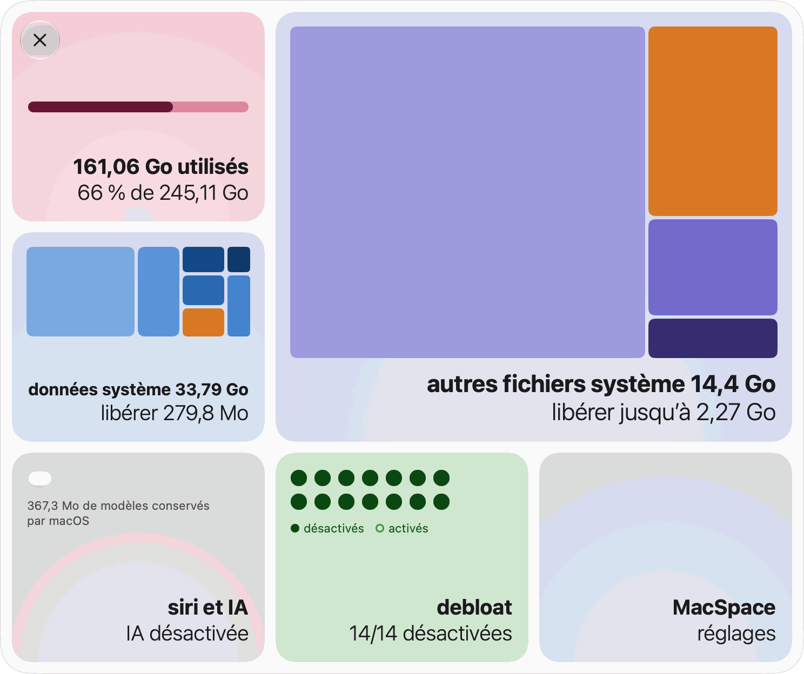
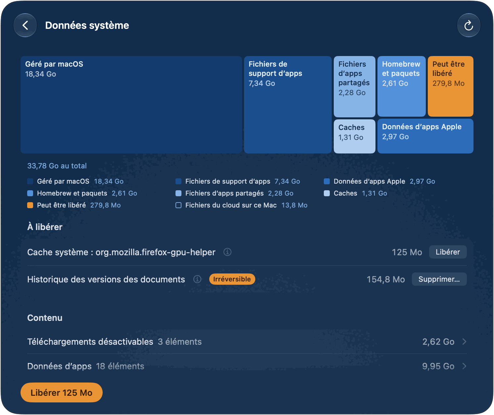
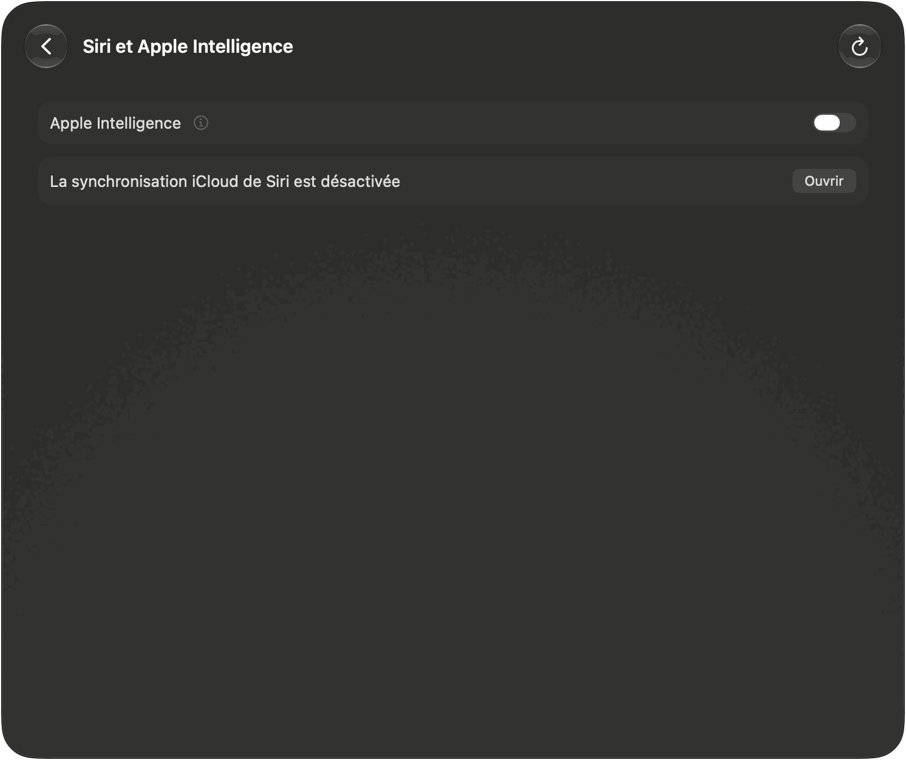
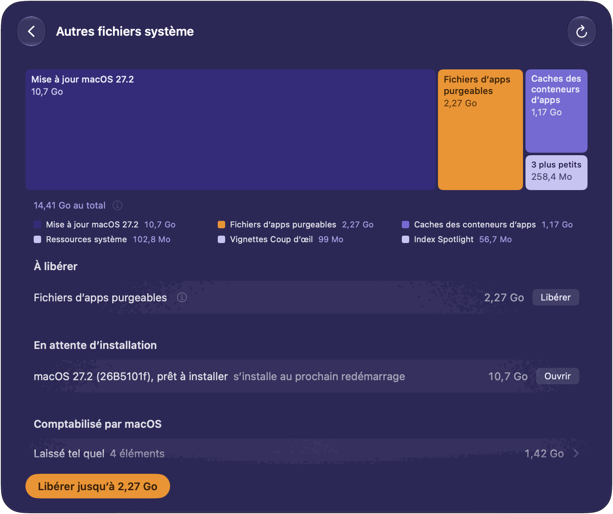
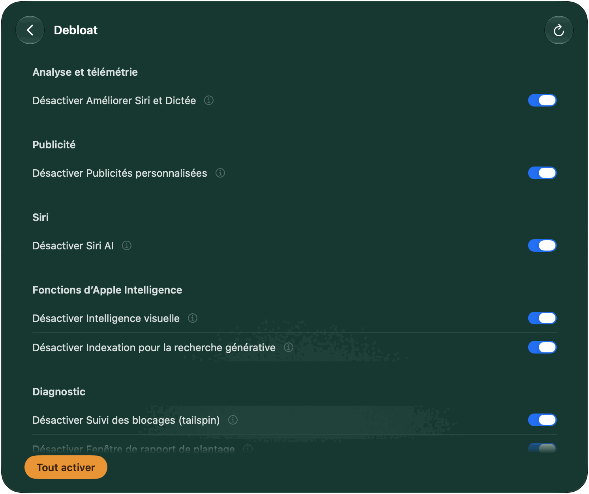
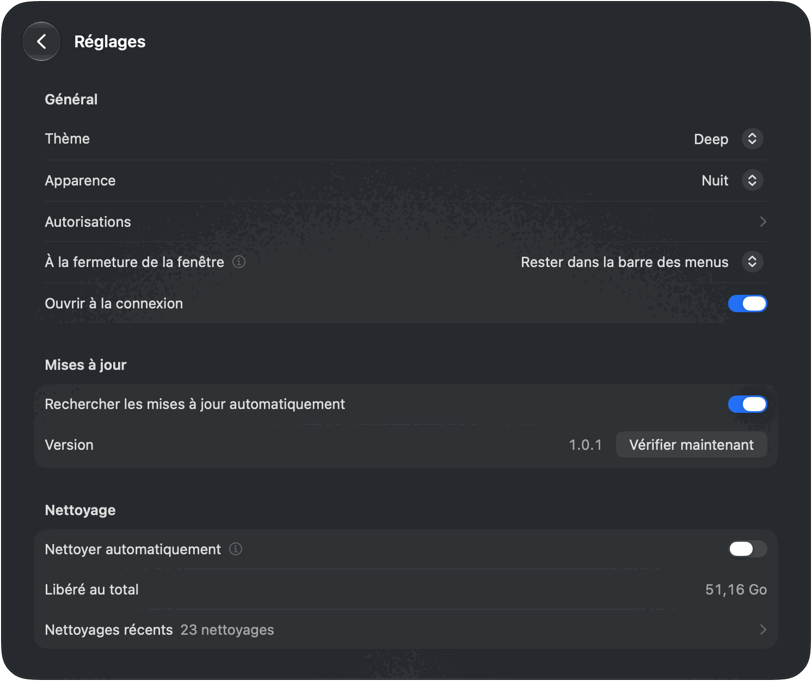

[English](README.md) · [Português](README.pt-BR.md) · [Español](README.es.md) · **Français** · [Deutsch](README.de.md)

# MacSpace

**Un outil de nettoyage de Données système et d’Apple Intelligence pour macOS.**

[](https://github.com/1architect/macspace-releases/actions/workflows/ci.yml)
[](https://github.com/1architect/macspace-releases/releases/latest)
[](LICENSE)


MacSpace montre ce qui remplit Données système et libère ce qui peut être supprimé sans risque.
Il désactive Apple Intelligence, puis supprime les modèles que macOS garde ensuite sur le disque.
Il libère les fichiers que les apps ont marqués comme purgeables, et il peut désactiver l’analyse
et la collecte de données en arrière-plan que macOS vous laisse contrôler. Il est gratuit et open
source, et il **ne collecte aucune donnée sur vous**.

[**Télécharger MacSpace**](#installation) ·
[Politique de confidentialité](PRIVACY.fr.md) ·
[Sécurité](SECURITY.fr.md) ·
[Journal des modifications](CHANGELOG.md) (en anglais)

<picture>
  <source media="(prefers-color-scheme: dark)" srcset="Docs/Screenshots/fr/Home-Dark.png">
  
</picture>

---

## Ce que fait MacSpace

MacSpace compte quatre modules. Chacun a une tuile sur la page d’accueil et une page à lui.
Cliquez sur une tuile pour ouvrir sa page. **Retour** remonte d’un niveau. Vous pouvez désactiver
n’importe quel module dans Réglages.

**Données système.** Données système est la partie du disque que Réglages Système n’explique pas.
MacSpace la calcule comme Réglages Système (espace utilisé, moins macOS et toutes les autres
catégories), si bien que le chiffre est proche de celui que vous y voyez. Puis il la détaille :
caches, journaux, rapports, ressources système, données d’apps, historique des versions des
documents. Ce qu’il ne peut pas nommer apparaît sous **Non identifié**. Rien n’est laissé de côté.

Le bouton principal, **Libérer** suivi d’une taille, supprime ce qui peut l’être sans risque : les
caches des apps fermées, les rapports de diagnostic et de plantage de plus de 7 jours, et les
ressources système inutilisées. Sous **À libérer**, chaque élément a son propre bouton. Deux
éléments sont mis à part, car ils demandent plus de précautions : **Historique des versions des
documents** (versions précédentes de vos documents ; les documents restent) et **Fichiers
restants de mise à jour de macOS** (fichiers d’une mise à jour déjà installée). Pour tout ce qui
appartient à macOS ou à d’autres apps, MacSpace explique de quoi il s’agit et ce qu’il faut faire
à la main.



**Siri et Apple Intelligence.** Un seul interrupteur, **Apple Intelligence**, sur la page et sur la
tuile. Désactivé, MacSpace règle Siri sur une langue différente de celle de votre Mac. C’est ainsi
que macOS décide qu’Apple Intelligence est indisponible. MacSpace supprime ensuite les modèles que
macOS garde sur le disque, ce qui peut représenter environ 12 Go. Réactivez-le, et MacSpace
rétablit la langue et la voix de Siri. Avec la synchronisation iCloud de Siri activée, le
changement de langue atteint aussi votre iPhone et votre iPad. La page l’indique et montre comment
désactiver la synchronisation. Elle indique aussi les autres comptes qui gardent Apple
Intelligence activé, car les modèles sont partagés par tous les comptes. Une vérification
facultative, **Vérifier qu’Apple Intelligence reste désactivé** dans Réglages, vous avertit si
macOS le réactive. Dans une machine virtuelle, macOS ne propose pas Apple Intelligence : la page
se contente de l’indiquer.



**Autres fichiers système.** L’espace situé hors de Données système que macOS compte comme
purgeable. macOS le libère quand le disque est presque plein. **Libérer jusqu’à** lui demande de le
faire tout de suite. La taille est une estimation de macOS, d’où « jusqu’à ». Les copies de
fichiers du cloud conservées sur ce Mac (OneDrive, iCloud Drive et autres dossiers cloud) ont une
ligne et un bouton à part, **Supprimer les téléchargements**. Les fichiers restent dans le cloud
et sont retéléchargés à leur ouverture. Une mise à jour de macOS prête à être installée figure
sous **En attente d’installation**. MacSpace ne la supprime pas.



**Debloat.** Quatorze interrupteurs pour l’analyse, la publicité et la collecte de données en
arrière-plan que macOS vous laisse contrôler. Chaque interrupteur s’appelle **Désactiver …** :
activé signifie que MacSpace a désactivé cette fonction. **Tout désactiver** désactive tout ce qui
est encore activé. **Tout activer** rétablit ce que MacSpace a modifié, à partir des réglages
enregistrés au préalable. Tant que MacSpace est ouvert, il vérifie toutes les 15 minutes et
désactive de nouveau tout ce que macOS a réactivé (sauf les règles), et peut vous avertir quand il
le fait.

| Interrupteur | Ce qu’il fait | Prend effet |
|---|---|---|
| Partager l’analyse avec Apple | Cesse d’envoyer les données d’utilisation et de plantage à Apple et aux développeurs. | Tout de suite |
| Améliorer Siri et Dictée | Cesse de partager les enregistrements de Siri et de la dictée avec Apple. | Tout de suite |
| Dictée et traduction sur les serveurs d’Apple | La dictée et la traduction restent sur ce Mac. Les langues sans modèle sur l’appareil ne fonctionnent plus. | Après réouverture des apps |
| Publicités personnalisées | Apple cesse de choisir des publicités selon ce que vous faites. | Après réouverture des apps |
| Identifiant publicitaire | Les apps ne peuvent ni vous suivre avec l’identifiant publicitaire ni vous le demander. | Après réouverture des apps |
| Siri AI | Désactive Siri AI. Spotlight revient à la recherche classique. | Après redémarrage |
| Intelligence visuelle | Désactive l’intelligence visuelle. Recherche visuelle peut aussi cesser de fonctionner. | Après redémarrage |
| Indexation pour la recherche générative | Empêche Apple Intelligence d’indexer Mail et vos données personnelles. | Après redémarrage |
| Fonctions d’Apple Intelligence | Désactive les outils d’écriture, Genmoji, Image Playground, les résumés, les réponses intelligentes et ChatGPT. | Après réouverture des apps |
| Résultats Internet dans Spotlight | Spotlight cesse d’envoyer vos recherches à Apple. Plus de résultats web dans Spotlight. | Après réouverture des apps |
| Suivi des blocages (tailspin) | Empêche macOS d’enregistrer en continu l’activité pour les rapports de blocage. Libère environ 100 Mo de mémoire. | Tout de suite |
| Fenêtre de rapport de plantage | Plus de fenêtres « s’est fermé de façon inattendue ». | Après redémarrage |
| Game Center | Désactive Game Center. | Après fermeture de session |
| Apple News | Masque Apple News et ses widgets. | Après fermeture de session |

Six de ces fonctions sont des règles. En désactiver une vous demande d’approuver une fois un profil
dans Réglages Système (voir [Autorisations](#premier-lancement-et-autorisations)). Sur une version
bêta de macOS, l’interrupteur d’analyse est aussi une règle, car macOS y ignore le réglage.



**Et aussi dans MacSpace.** **Nettoyer automatiquement** (dans Réglages, désactivé jusqu’à ce que
vous l’activiez) libère, sans rien demander, ce que les modules peuvent libérer, tous les jours,
tous les 3 jours ou toutes les semaines, tant que MacSpace est ouvert. Debloat n’y participe pas,
et l’historique des versions n’est jamais supprimé. **Nettoyages récents** liste ce que chacun a
libéré. MacSpace vous avertit quand le nettoyage automatique libère au moins 100 Mo, quand une
action qui a pris du temps se termine alors que MacSpace n’est pas au premier plan, et quand le
disque est presque plein (une fois par jour au plus). Chaque notification peut être désactivée.
**À la fermeture de la fenêtre**, MacSpace peut quitter, rester dans la barre des menus (par
défaut) ou rester actif en arrière-plan, sans rien afficher. Un clic droit sur l’icône de la barre
des menus ouvre un menu avec chaque module, **Réglages…**, **Ouvrir le panneau** et **Quitter
MacSpace**. MacSpace parle anglais, portugais (Brésil), français, espagnol et allemand, et suit la
langue de votre système.

---

## Installation

### Homebrew (officiel)

```bash
brew install --cask 1architect/macspace/macspace
```

### Téléchargement direct (DMG)

Téléchargez le dernier `MacSpace-x.y.z.dmg` depuis
[Releases](https://github.com/1architect/macspace-releases/releases/latest), ouvrez-le et glissez
**MacSpace** dans votre dossier Applications. Ouvrez MacSpace depuis ce dossier. Il doit s’exécuter
depuis un dossier Applications, car l’assistant ne s’enregistre que de là.

Chaque version a aussi un fichier `MacSpace-x.y.z.dmg.sha256`. Pour vérifier votre téléchargement,
placez les deux fichiers dans un même dossier et exécutez :

```bash
shasum -a 256 -c MacSpace-x.y.z.dmg.sha256
```

La commande affiche `MacSpace-x.y.z.dmg: OK`. MacSpace est signé avec un Developer ID et notarisé
par Apple. [Sécurité](SECURITY.fr.md) montre aussi comment le vérifier.

### Configuration requise

macOS 27 ou version ultérieure, sur Apple Silicon. macOS 27 ne fonctionne que sur Apple Silicon,
et MacSpace n’est conçu que pour lui.

### Mises à jour et réglages

MacSpace se met à jour avec [Sparkle](https://sparkle-project.org). Choisissez **Rechercher des
mises à jour…** dans le menu MacSpace, ou **Vérifier maintenant** sous **Réglages > Mises à jour**. **Rechercher les mises à jour automatiquement**, au même endroit, permet à MacSpace de
vérifier environ une fois par jour tant qu’il est ouvert. Tant que vous ne l’activez pas, ou que
vous ne répondez pas à la question que Sparkle pose une fois à partir du deuxième lancement,
MacSpace ne vérifie rien de lui-même. Chaque mise à jour est signée, et Sparkle vérifie la
signature avant d’installer quoi que ce soit. Avec Homebrew, vous pouvez aussi exécuter
`brew upgrade --cask macspace` (ajoutez `--greedy` si Homebrew l’ignore, car MacSpace se met à
jour lui-même).



---

## Premier lancement et autorisations

Sur une nouvelle installation, MacSpace commence par ce dont il a besoin, un écran à la fois :
**Autoriser l’accès complet au disque**, **Approuvez l’assistant**, **Soyez averti**, puis **Tout
est prêt**. Chaque étape peut attendre (**Plus tard**), et les étapes déjà faites sont ignorées.
Vous pouvez y revenir dans **Réglages > Autorisations**.


| Autorisation | Où l’accorder | Pourquoi MacSpace en a besoin | Modules |
|---|---|---|---|
| Accès complet au disque | Réglages Système > Confidentialité et sécurité > Accès complet au disque | Pour mesurer tout le disque et lire l’état d’Apple Intelligence. | Données système, Siri et Apple Intelligence |
| Assistant privilégié | Réglages Système > Général > Ouverture et extensions, sous **Autoriser en arrière-plan** | Un petit programme qui effectue les quelques tâches qui demandent un administrateur (voir ci-dessous). | Données système, Siri et Apple Intelligence, Debloat |
| Notifications | macOS le demande la première fois | Pour vous dire quand quelque chose est terminé ou a besoin de vous. | Tous |
| Profil de configuration | Réglages Système > Général > Gestion de l’appareil | Applique les règles Debloat que vous activez. Nécessaire seulement pour les six règles. | Debloat |

Autres fichiers système n’a besoin d’aucune autorisation propre. macOS gère chaque autorisation :
MacSpace ne voit donc jamais votre mot de passe. Sans une autorisation, un module en fait moins et
dit ce qui manque.

L’assistant est un démon de lancement, `com.macspace.helper`. Il n’exécute que des opérations
nommées, intégrées à son code ; un appelant ne peut pas lui envoyer de commandes, et il n’accepte
que les clients signés par la même équipe de développement que MacSpace. Entre autres, il peut
mesurer la taille des dossiers système (jamais celle d’un dossier de départ), supprimer
l’historique des versions des documents et les fichiers restants d’une mise à jour de macOS
installée, modifier les interrupteurs Debloat qui demandent un administrateur, et supprimer le
profil MacSpace. [Sécurité](SECURITY.fr.md) donne la liste complète.

---

## Sécurité d’utilisation

**Ce qu’il supprime.** Seulement ce qu’il peut nommer. Rien ne va dans la Corbeille.

- Les caches que les apps recréent : ceux du dossier de cache système de chaque utilisateur
  (`/var/folders/…/C`) et les caches web (`Cache`, `Code Cache`, `GPUCache`) que les apps Chromium
  et Electron gardent dans `~/Library/Application Support`. Seulement quand l’app qui les possède
  est fermée. `~/Library/Caches` est listé, pas nettoyé.
- Les rapports de diagnostic et de plantage de plus de 7 jours, dans
  `/Library/Logs/DiagnosticReports` et `~/Library/Logs/DiagnosticReports`.
- Les ressources système inutilisées, les modèles Apple Intelligence que macOS a libérés, et les
  fichiers que les apps ont marqués comme purgeables. MacSpace les demande au service de purge de
  macOS, celui que macOS lance quand le disque est presque plein. Ils sont retéléchargés au besoin.
- Seulement quand vous appuyez sur leur propre bouton : l’historique des versions des documents,
  les fichiers restants d’une mise à jour de macOS installée, et les copies locales de fichiers du
  cloud.

**Ce qu’il ne touche jamais.** MacSpace mesure l’espace que prennent vos documents, Photos, Mail et
Messages. Il ne lit pas leur contenu et ne les supprime jamais. Il liste les gros éléments, comme
les téléchargements inachevés, les images de restauration de macOS et les machines virtuelles, et
vous en laisse la décision. Il ne touche pas aux données des autres apps et explique comment les
nettoyer depuis l’app elle-même. Il ne désactive pas la protection de l’intégrité du système et ne
modifie pas le volume système scellé.

**Ce qui demande avant d’agir.** Chaque bouton qui supprime les caches de plus d’une app demande
une confirmation. **Supprimer…** sur **Historique des versions des documents** porte un badge
**Irréversible**. L’interrupteur **Apple Intelligence** et les interrupteurs Debloat pris un à un
agissent tout de suite, et reviennent en arrière d’eux-mêmes si la modification échoue.

**Ce que vous pouvez annuler.** Debloat : réactivez une fonction, ou appuyez sur **Tout activer**.
MacSpace rétablit les réglages qu’il avait enregistrés avant de les modifier. Apple Intelligence :
réactivez-le. MacSpace rétablit la langue et la voix de Siri, et macOS peut retélécharger les
modèles. Les caches supprimés se reconstruisent. Les rapports et l’historique des versions
supprimés ne reviennent pas.

**Machines virtuelles.** Dans une machine virtuelle, **Siri et Apple Intelligence** ne fait rien et
dit pourquoi. Debloat y liste quand même des interrupteurs qui ne peuvent pas prendre effet dans
une machine virtuelle.

Le comportement de macOS, mesures à l’appui, est décrit dans [Docs/Research.md](Docs/Research.md)
(en anglais).

---

## Confidentialité

MacSpace n’a ni analyse d’usage, ni télémétrie, ni rapport de plantage, ni compte. Ce qu’il
mesure, votre historique de nettoyage et vos réglages restent sur votre Mac, dans
`~/Library/Application Support/MacSpace/`. Le réseau ne sert qu’à une chose : les mises à jour.
MacSpace lit un petit flux de mises à jour sur GitHub et, si vous acceptez une mise à jour, la
télécharge depuis GitHub. Il n’envoie ni profil système ni identifiant. Chaque fichier qu’il écrit,
et tout ce qu’il lit, figure dans la [Politique de confidentialité](PRIVACY.fr.md) et la
[Politique de sécurité](SECURITY.fr.md).

---

## Désinstallation

Il n’y a pas de programme de désinstallation. Pour supprimer MacSpace et tout ce qu’il a modifié :

1. **Annulez ce que MacSpace a modifié.** Dans **Debloat**, appuyez sur **Tout activer**. Cela
   supprime aussi les surcharges que Debloat a écrites en dehors des dossiers propres à MacSpace,
   et qui restent en place si vous supprimez simplement l’app. Si un redémarrage est nécessaire,
   la page l’indique. Si vous avez désactivé Apple Intelligence et voulez le retrouver, activez-le
   dans **Siri et Apple Intelligence**.
2. **Supprimez le profil**, s’il est encore installé : dans Réglages Système > Général > Gestion
   de l’appareil, sélectionnez **MacSpace: policies** (identifiant `com.macspace.policies`) et
   supprimez-le.
3. **Quittez MacSpace** (**Quitter MacSpace** dans le menu MacSpace, ou dans le menu de l’icône de
   la barre des menus). Supprimez l’assistant : désactivez MacSpace sous Réglages Système >
   Général > Ouverture et extensions, ou exécutez ceci avant de supprimer l’app :
   ```bash
   /Applications/MacSpace.app/Contents/MacOS/MacSpaceCli helper --unregister
   ```
4. **Supprimez l’app :** `brew uninstall --cask macspace` (ajoutez `--zap` pour supprimer aussi ses
   données et ses préférences), ou glissez **MacSpace** du dossier Applications vers la Corbeille.
5. **Supprimez ses données et ses préférences :**
   ```bash
   rm -rf ~/Library/Application\ Support/MacSpace ~/Library/Logs/MacSpace ~/Library/Caches/com.macspace.app
   defaults delete com.macspace.app
   sudo rm -rf /Library/Application\ Support/MacSpace
   ```
   La dernière ligne n’est nécessaire que si vous avez utilisé Debloat ou supprimé des abonnements
   Apple Intelligence restants. Exécutez-la après l’étape 1 : ce dossier contient les originaux
   que MacSpace rétablit.
6. **Retirez l’accès complet au disque :** dans Réglages Système > Confidentialité et sécurité >
   Accès complet au disque, sélectionnez MacSpace et appuyez sur le bouton moins.

---

## Compiler depuis les sources

Le code source est ce dépôt. [Docs/Handoff.md](Docs/Handoff.md) (en anglais) explique comment il
est organisé. Il vous faut macOS 27 et Xcode 27.

```bash
export DEVELOPER_DIR=/Applications/Xcode-beta.app/Contents/Developer
swift test
INSTALL=1 Scripts/Assemble.sh
```

La dernière commande compile `Build/MacSpace.app` et le copie dans `/Applications`. Sans certificat
Developer ID, la compilation est signée ad hoc et n’est pas notarisée, et macOS redemande l’accès
complet au disque après chaque compilation. Une version que vous compilez vous-même n’a pas de clé
de mise à jour : elle ne recherche donc jamais de mises à jour.

---

## Assistance et contribution

**dev@giomantovani.com.br**

Bugs, idées et traductions erronées : [GitHub Issues](https://github.com/1architect/macspace-releases/issues).
Problèmes de sécurité : jamais dans un ticket public, voir [SECURITY.fr.md](SECURITY.fr.md). Pour
contribuer, lisez [CONTRIBUTING.md](CONTRIBUTING.md) (en anglais). Toute personne qui participe
respecte le [Code de conduite](CODE_OF_CONDUCT.md) (en anglais). Les modifications sont listées
dans le [Journal des modifications](CHANGELOG.md).

---

## Licence

MacSpace est un logiciel libre sous licence MIT. Copyright (c) 2026 1architect. Voir
[LICENSE](LICENSE) (en anglais). Le texte anglais fait foi. Les traductions, dans
`LICENSE.<langue>.md`, sont fournies à titre indicatif. Les mentions relatives aux composants tiers
se trouvent dans [NOTICE](NOTICE) (en anglais).

MacSpace n’est pas affilié à Apple. Apple Intelligence, Siri et macOS sont des marques d’Apple Inc.
