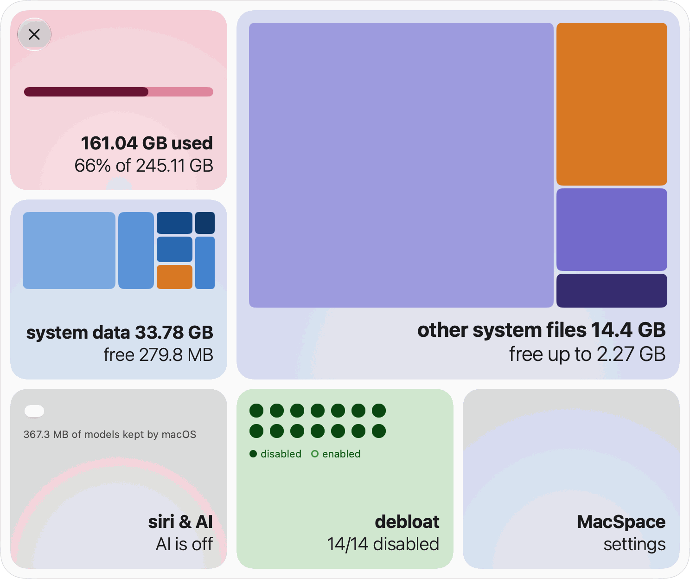
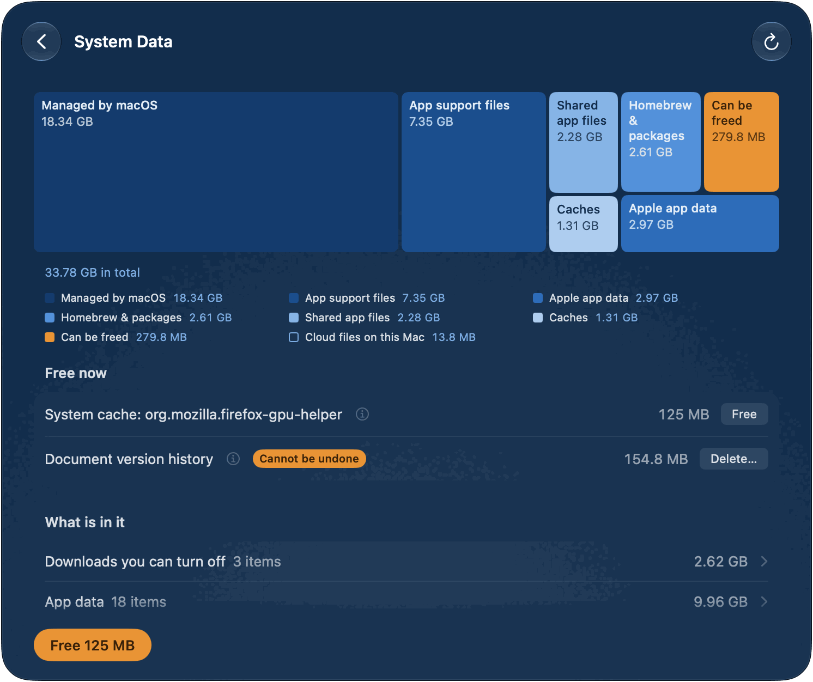
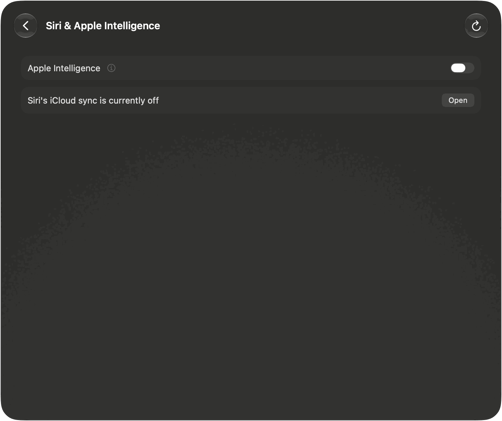
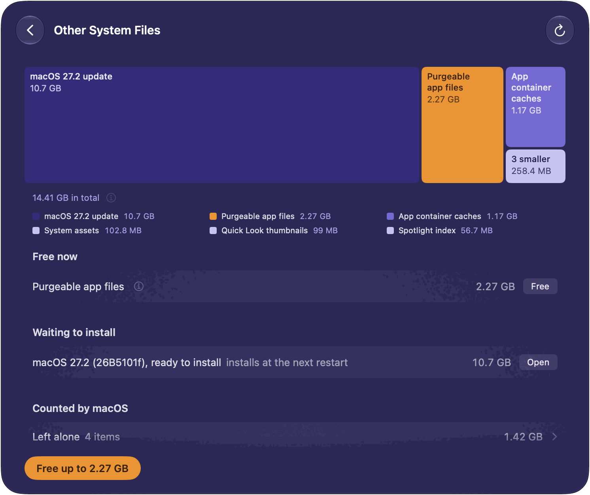
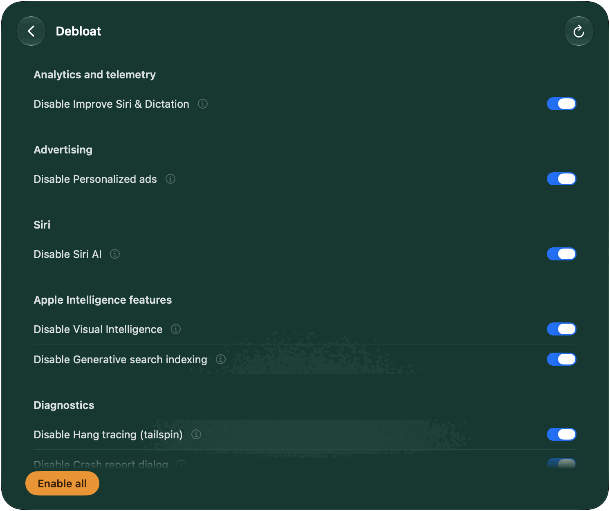
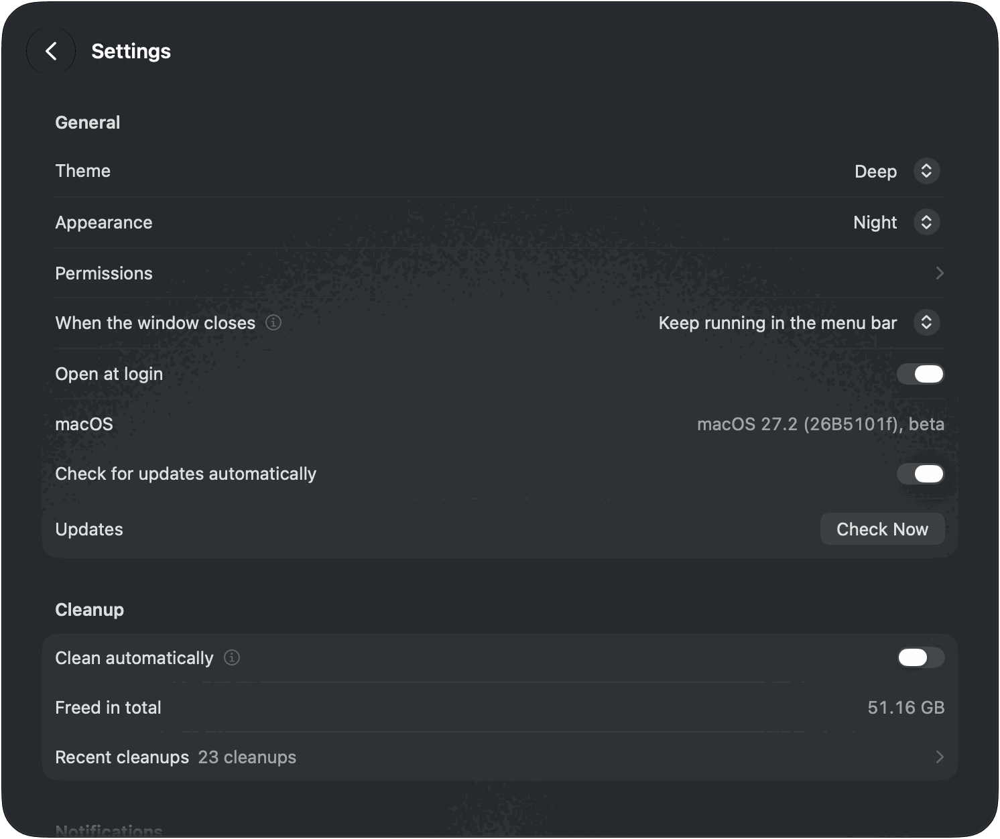
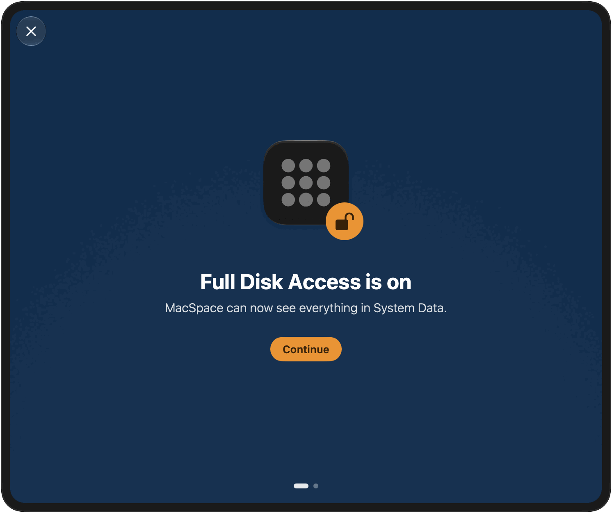

**English** · [Português](README.pt-BR.md) · [Español](README.es.md) · [Français](README.fr.md) · [Deutsch](README.de.md)

# MacSpace

**A System Data and Apple Intelligence cleaner for macOS.**

[](https://github.com/1architect/macspace-releases/actions/workflows/ci.yml)
[](https://github.com/1architect/macspace-releases/releases/latest)
[](LICENSE)


MacSpace shows what fills System Data and frees what is safe to delete. It switches Apple
Intelligence off and deletes the models macOS keeps on disk afterwards. It frees the files
apps marked purgeable, and it can turn off the analytics and background data collection that
macOS lets you control. It is free and open source, and it **collects no data about you**.

[**Download MacSpace**](#install) ·
[Privacy Policy](PRIVACY.md) ·
[Security](SECURITY.md) ·
[Changelog](CHANGELOG.md)

<p align="center">
  <picture>
    <source media="(prefers-color-scheme: dark)" srcset="Docs/Screenshots/en/Home-Dark.png">
    
  </picture>
</p>

---

## What it does

MacSpace has four modules. Each has a tile on the home page and a page of its own. Click a tile
to open its page. **Back** goes up one level. You can switch any module off in Settings.

**System Data.** System Data is the part of the disk that System Settings does not explain.
MacSpace works it out the way System Settings does (used space, less macOS and every other
category), so the figure is close to the one you see there. Then it breaks it down: caches, logs,
reports, system assets, app data, document version history. What it cannot name shows as
**Not identified**. It is never left out.

The main button, **Free** with a size, deletes what is safe: caches of apps that are closed,
diagnostic and crash reports older than 7 days, and unused system assets. Under **Free now**,
each item has its own button. Two items are kept apart because they need more care: **Document
version history** (earlier versions of your documents; the documents stay) and **Leftover macOS
update files** (files of an update that is already installed). For everything that belongs to
macOS or to other apps, MacSpace says what it is and what to do by hand.

<p align="center">
  
</p>

**Siri & Apple Intelligence.** One switch, **Apple Intelligence**, on the page and on the tile.
Switched off, MacSpace sets Siri to a language other than your Mac's. That is how macOS decides
that Apple Intelligence is unavailable. MacSpace then deletes the models macOS keeps on disk,
which can be about 12 GB. Switch it on again and MacSpace puts your Siri language and voice
back. With Siri's iCloud sync on, the language change also reaches your iPhone and iPad. The
page says so and shows how to turn the sync off. It also names other accounts that keep Apple
Intelligence on, because the models are shared by all accounts. An optional check, **Check that
Apple Intelligence stays off** in Settings, tells you if macOS turns it back on. In a virtual
machine macOS does not offer Apple Intelligence, so the page only says that.

<p align="center">
  
</p>

**Other System Files.** Space outside System Data that macOS counts as purgeable. macOS frees it
when the disk is nearly full. **Free up to** asks it to do that now. The size is macOS's
estimate, which is why it says "up to". Copies of cloud files kept on this Mac (OneDrive, iCloud
Drive and other cloud folders) have a row and a button of their own, **Remove Downloads**. The
files stay in the cloud and download again when you open them. A macOS update that is ready to
install is listed under **Waiting to install**. MacSpace does not delete it.

<p align="center">
  
</p>

**Debloat.** Fourteen switches for analytics, advertising and background data collection that
macOS lets you control. Each switch is named **Disable …**: on means MacSpace switched that
feature off. **Disable all** switches off everything still on. **Enable all** puts back what
MacSpace changed, using the settings it saved first. While MacSpace runs, it checks every 15
minutes and switches off again anything macOS turned back on (policies excepted), and can tell
you when it does.

| Switch | What it does | Takes effect after |
|---|---|---|
| Share analytics with Apple | Stops sending usage and crash data to Apple and app developers. | Nothing |
| Improve Siri & Dictation | Stops sharing Siri and Dictation recordings with Apple. | Nothing |
| Dictation and translation on Apple servers | Dictation and translation stay on this Mac. Languages without an on-device model stop working. | Reopening apps |
| Personalized ads | Apple stops picking ads based on what you do. | Reopening apps |
| Advertising identifier | Apps can't track you with the advertising identifier or ask to. | Reopening apps |
| Siri AI | Turns off Siri AI. Spotlight goes back to classic search. | A restart |
| Visual Intelligence | Turns off Visual Intelligence. Visual Look Up may stop working too. | A restart |
| Generative search indexing | Stops Apple Intelligence from indexing your Mail and personal data. | A restart |
| Apple Intelligence features | Turns off Writing Tools, Genmoji, Image Playground, summaries, smart replies and ChatGPT. | Reopening apps |
| Spotlight internet results | Spotlight stops sending your searches to Apple. No more web results in Spotlight. | Reopening apps |
| Hang tracing (tailspin) | Stops macOS from constantly recording activity for hang reports. Frees about 100 MB of memory. | Nothing |
| Crash report dialog | No more "quit unexpectedly" dialogs. | A restart |
| Game Center | Turns off Game Center. | Logging out |
| Apple News | Hides Apple News and its widgets. | Logging out |

Six of these are policies. Disabling one asks you to approve a profile in System Settings once
(see [Permissions](#first-launch-and-permissions)). On a beta of macOS, the analytics switch is a
policy too, because macOS ignores the setting there.

<p align="center">
  
</p>

**Also in MacSpace.** **Clean automatically** (Settings, off until you turn it on) frees what
the modules can free without asking, every day, every 3 days or every week, while MacSpace is
running. Debloat takes no part, and version history is never deleted. **Recent cleanups** lists
what each one freed. MacSpace notifies you when automatic cleanup frees at least 100 MB, when an
action that took a while ends while MacSpace is not in front, and when the disk is almost full
(once a day at most). Each notification can be switched off. **When the window closes**, MacSpace
can quit, keep running in the menu bar (the default) or keep running unseen in the background.
Right-click the menu bar icon for a menu with each module, **Settings…**, **Open Panel** and
**Quit MacSpace**. MacSpace speaks English, Portuguese (Brazil), French, Spanish and German, and
follows your system language.

---

## Install

### Homebrew (official)

```bash
brew install --cask 1architect/macspace/macspace
```

### Direct download (DMG)

Download the latest `MacSpace-x.y.z.dmg` from
[Releases](https://github.com/1architect/macspace-releases/releases/latest), open it, and drag
**MacSpace** to your Applications folder. Open MacSpace from there. It must run from an
Applications folder, because the helper registers only from there.

Each release also has `MacSpace-x.y.z.dmg.sha256`. To check your download, put both files in one
folder and run:

```bash
shasum -a 256 -c MacSpace-x.y.z.dmg.sha256
```

It prints `MacSpace-x.y.z.dmg: OK`. MacSpace is signed with a Developer ID and notarized by
Apple. [Security](SECURITY.md) shows how to check that too.

### Requirements

macOS 27 or later, on Apple Silicon. macOS 27 runs only on Apple Silicon, and MacSpace is built
for it only.

### Updates and settings

MacSpace updates with [Sparkle](https://sparkle-project.org). Choose **Check for Updates…** in
the MacSpace menu, or **Check Now** under **Settings > Updates**. **Check for updates
automatically**, in the same place, lets MacSpace look about once a day while it runs. Until you
switch it on, or answer the question Sparkle asks once from the second launch, MacSpace does not
check by itself. Every update is signed, and Sparkle checks the signature before it installs
anything. With Homebrew, you can also run `brew upgrade --cask macspace` (add `--greedy` if
Homebrew skips it, because MacSpace updates itself).

<p align="center">
  
</p>

---

## First launch and permissions

On a new install, MacSpace starts with what it needs, one screen at a time: **Allow Full Disk
Access**, **Approve the helper**, **Get notified**, then **You're all set**. Each step can wait
(**Later**), and steps you have already done are skipped. You can come back to them in
**Settings > Permissions**.

<p align="center">
  
</p>

| Permission | Where you give it | Why MacSpace needs it | Modules |
|---|---|---|---|
| Full Disk Access | System Settings > Privacy & Security > Full Disk Access | To measure everything on the disk, and to read the state of Apple Intelligence. | System Data, Siri & Apple Intelligence |
| Privileged helper | System Settings > General > Login Items & Extensions, under **Allow in the Background** | A small program that does the few things that need an administrator (see below). | System Data, Siri & Apple Intelligence, Debloat |
| Notifications | macOS asks the first time | To tell you when something finished or needs you. | All |
| Configuration profile | System Settings > General > Device Management | Applies the Debloat policies you turn on. Needed only for the six policies. | Debloat |

Other System Files needs no permission of its own. macOS handles every authorization, so
MacSpace never sees your password. Without a permission, a module does less and says what is
missing.

The helper is a launch daemon, `com.macspace.helper`. It runs only named operations that are
built into it, a caller cannot send it commands, and it accepts only clients signed by the same
developer team as MacSpace. Among other things, it can measure the size of system
folders (never of a home folder), delete the document version history and the leftover files of
an installed macOS update, change the Debloat switches that need an administrator, and remove
the MacSpace profile. [Security](SECURITY.md) has the full list.

---

## Safety

**What it deletes.** Only what it can name. Nothing goes to the Trash.

- Caches that apps rebuild: the caches in the per-user system cache folder (`/var/folders/…/C`)
  and the web caches (`Cache`, `Code Cache`, `GPUCache`) that Chromium and Electron apps keep in
  `~/Library/Application Support`. Only while the app that owns them is closed.
  `~/Library/Caches` is listed, not cleaned.
- Diagnostic and crash reports older than 7 days, in `/Library/Logs/DiagnosticReports` and
  `~/Library/Logs/DiagnosticReports`.
- Unused system assets, Apple Intelligence models that macOS has released, and files apps marked
  purgeable. MacSpace asks macOS's own purge service for these, the one macOS runs when the disk
  is nearly full. They download again if they are needed.
- Only when you press its own button: the document version history, the leftover files of an
  installed macOS update, and the local copies of cloud files.

**What it never touches.** MacSpace measures how much space your documents, Photos, Mail and
Messages take. It does not read what is in them and never deletes them. It lists large items such
as unfinished downloads, macOS restore images and virtual machines, and leaves them to you. It
leaves other apps' data alone and says how to clean it from inside the app. It does not turn off
System Integrity Protection and does not change the sealed system volume.

**What asks first.** Every button that deletes more than one app's caches asks for confirmation.
**Delete…** on **Document version history** carries a **Cannot be undone** badge. The **Apple
Intelligence** switch and the single Debloat switches act at once, and go back by themselves if
the change fails.

**What you can undo.** Debloat: switch a feature back on, or press **Enable all**. MacSpace
restores the settings it saved before it changed them. Apple Intelligence: switch it on again.
MacSpace restores your Siri language and voice, and macOS may download the models again. Deleted
caches rebuild. Deleted reports and version history do not come back.

**Virtual machines.** In a virtual machine, **Siri & Apple Intelligence** does nothing and says
why. Debloat still lists switches there that cannot take effect in a virtual machine.

How macOS behaves, with measurements, is in [Docs/Research.md](Docs/Research.md).

---

## Privacy

MacSpace has no analytics, no telemetry, no crash reporting and no account. What it measures,
your cleanup history and your settings stay on your Mac, under
`~/Library/Application Support/MacSpace/`. The network is used for one thing: updates. MacSpace
reads a small update feed on GitHub and, if you accept an update, downloads it from GitHub. It
sends no system profile and no identifier. Every file it writes, and everything it reads, is in
the [Privacy Policy](PRIVACY.md) and the [Security Policy](SECURITY.md).

---

## Uninstall

There is no uninstaller. To remove MacSpace and everything it changed:

1. **Undo what MacSpace changed.** In **Debloat**, press **Enable all**. This also removes the
   overrides Debloat wrote outside MacSpace's own folders, which stay in place if you just delete
   the app. If a restart is needed, the page says so. If you switched Apple Intelligence off and
   want it back, switch it on in **Siri & Apple Intelligence**.
2. **Remove the profile**, if one is still installed: in System Settings > General > Device
   Management, select **MacSpace: policies** (identifier `com.macspace.policies`) and remove it.
3. **Quit MacSpace** (**Quit MacSpace** in the MacSpace menu, or in the menu of its menu bar
   icon). Remove the helper: turn off MacSpace under System Settings > General > Login Items &
   Extensions, or run this before you delete the app:
   ```bash
   /Applications/MacSpace.app/Contents/MacOS/MacSpaceCli helper --unregister
   ```
4. **Remove the app:** `brew uninstall --cask macspace` (add `--zap` to remove its data and
   preferences too), or drag **MacSpace** from Applications to the Trash.
5. **Remove its data and preferences:**
   ```bash
   rm -rf ~/Library/Application\ Support/MacSpace ~/Library/Logs/MacSpace ~/Library/Caches/com.macspace.app
   defaults delete com.macspace.app
   sudo rm -rf /Library/Application\ Support/MacSpace
   ```
   The last line is needed only if you used Debloat or removed leftover Apple Intelligence
   subscriptions. Run it after step 1: that folder holds the originals MacSpace restores.
6. **Remove Full Disk Access:** in System Settings > Privacy & Security > Full Disk Access, select
   MacSpace and press the minus button.

---

## Build from source

The source is this repository. [Docs/Handoff.md](Docs/Handoff.md) explains how it is put
together. You need macOS 27 and Xcode 27.

```bash
export DEVELOPER_DIR=/Applications/Xcode-beta.app/Contents/Developer
swift test
INSTALL=1 Scripts/Assemble.sh
```

The last command builds `Build/MacSpace.app` and copies it to `/Applications`. Without a
Developer ID certificate, the build is signed ad hoc and not notarized, and macOS asks for Full
Disk Access again after each build. A build you make yourself has no update key, so it never
checks for updates.

---

## Support and contributing

**dev@giomantovani.com.br**

Bugs, ideas and wrong translations: [GitHub Issues](https://github.com/1architect/macspace-releases/issues).
Security problems: never a public issue, see [SECURITY.md](SECURITY.md). To contribute, read
[CONTRIBUTING.md](CONTRIBUTING.md). Everyone who takes part follows the
[Code of Conduct](CODE_OF_CONDUCT.md). Changes are listed in the [Changelog](CHANGELOG.md).

---

## License

MacSpace is free software under the MIT License. Copyright (c) 2026 1architect. See
[LICENSE](LICENSE). The English text is the binding one. The translations in
`LICENSE.<language>.md` are for convenience. Third-party notices are in [NOTICE](NOTICE).

MacSpace is not affiliated with Apple. Apple Intelligence, Siri and macOS are trademarks of
Apple Inc.
