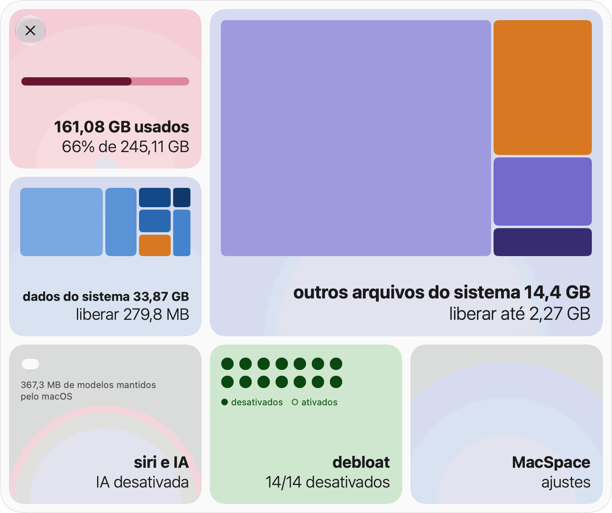
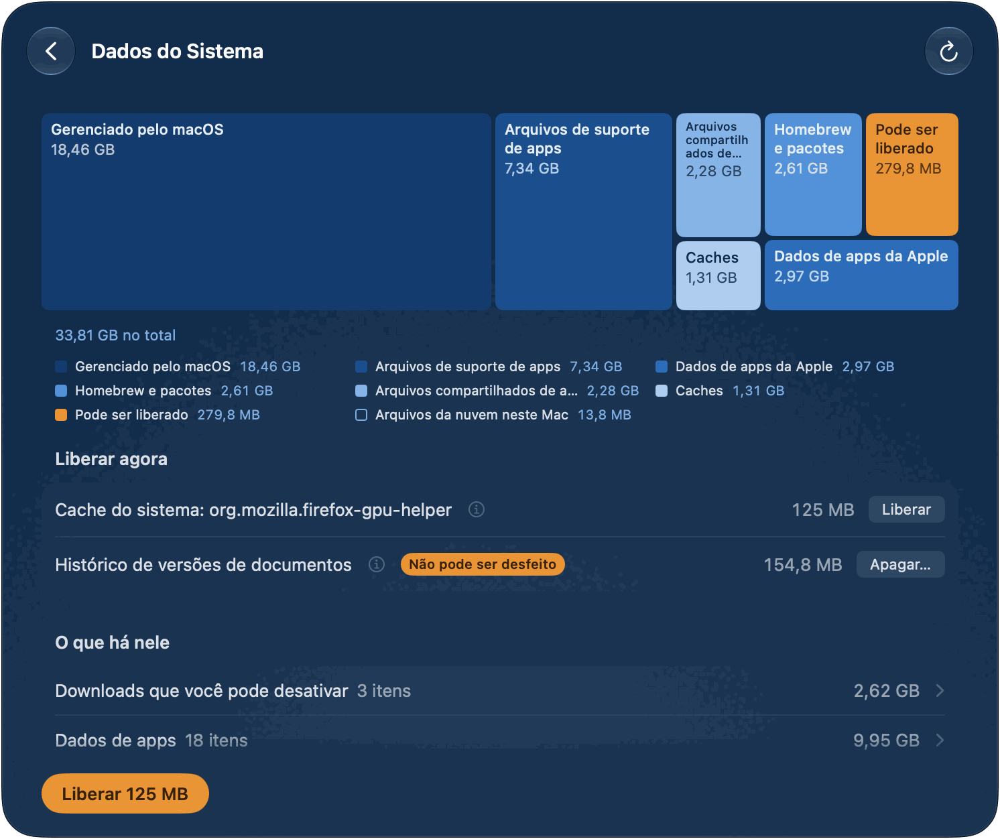
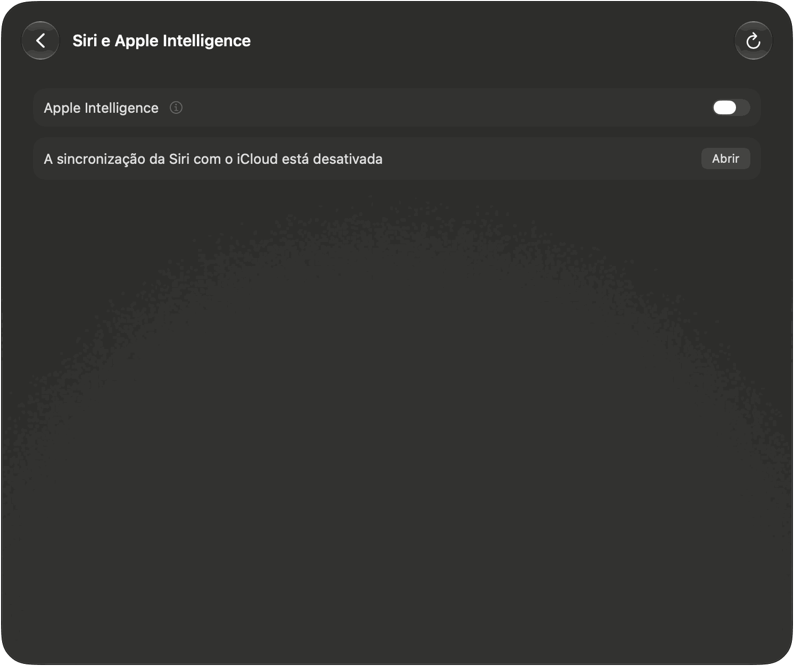
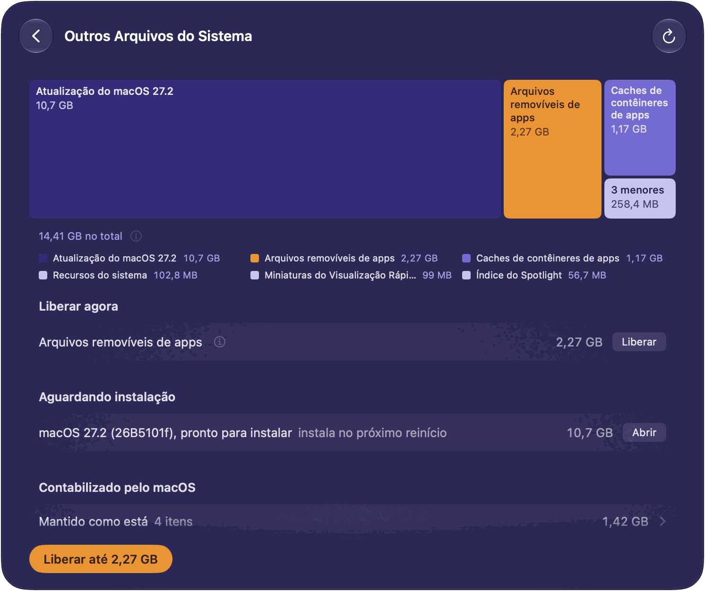
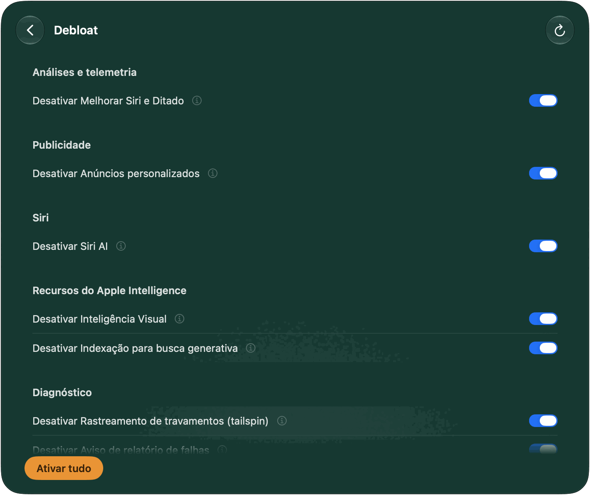
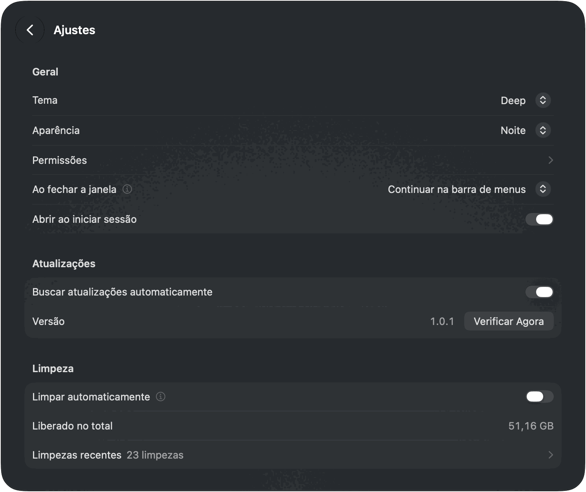

[English](README.md) · **Português** · [Español](README.es.md) · [Français](README.fr.md) · [Deutsch](README.de.md)

# MacSpace

**Um limpador de Dados do Sistema e do Apple Intelligence para o macOS.**

[](https://github.com/1architect/macspace-releases/actions/workflows/ci.yml)
[](https://github.com/1architect/macspace-releases/releases/latest)
[](LICENSE)


O MacSpace mostra o que ocupa Dados do Sistema e libera o que pode ser apagado com segurança. Ele
desativa o Apple Intelligence e apaga os modelos que o macOS mantém no disco depois disso. Libera
os arquivos que os apps marcaram como removíveis e pode desativar as análises e a coleta de dados
em segundo plano que o macOS permite controlar. É gratuito, de código aberto e **não coleta
nenhum dado sobre você**.

[**Baixar o MacSpace**](#instalar) ·
[Política de Privacidade](PRIVACY.pt-BR.md) ·
[Segurança](SECURITY.pt-BR.md) ·
[Histórico de alterações](CHANGELOG.md) (em inglês)

<picture>
  <source media="(prefers-color-scheme: dark)" srcset="Docs/Screenshots/pt-BR/Home-Dark.png">
  
</picture>

---

## O que o MacSpace faz

O MacSpace tem quatro módulos. Cada um tem um bloco na página inicial e uma página própria. Clique
em um bloco para abrir a página dele. **Voltar** sobe um nível. Você pode desativar qualquer módulo
nos Ajustes.

**Dados do Sistema.** Dados do Sistema é a parte do disco que os Ajustes do Sistema não explicam.
O MacSpace faz a conta do mesmo jeito que os Ajustes do Sistema (espaço usado, menos o macOS e
todas as outras categorias), então o valor fica perto do que você vê lá. Depois ele detalha:
caches, registros, relatórios, recursos do sistema, dados de apps, histórico de versões de
documentos. O que ele não consegue nomear aparece como **Não identificado**. Nunca fica de fora.

O botão principal, **Liberar** com um tamanho, apaga o que é seguro: caches de apps que estão
fechados, relatórios de diagnóstico e de falhas com mais de 7 dias e recursos do sistema sem uso.
Em **Liberar agora**, cada item tem o seu próprio botão. Dois itens ficam separados porque pedem
mais cuidado: **Histórico de versões de documentos** (versões anteriores dos seus documentos; os
documentos continuam) e **Arquivos restantes de atualização do macOS** (arquivos de uma
atualização que já está instalada). Para tudo o que pertence ao macOS ou a outros apps, o MacSpace
diz o que é e o que fazer manualmente.



**Siri e Apple Intelligence.** Um interruptor, **Apple Intelligence**, na página e no bloco.
Desativá-lo coloca a Siri num idioma diferente do seu Mac. É assim que o macOS decide que o Apple
Intelligence não está disponível. Em seguida, o MacSpace apaga os modelos que o macOS mantém no
disco, o que pode chegar a cerca de 12 GB. Ative-o de novo e o MacSpace devolve o idioma e a voz da
Siri. Com a sincronização da Siri com o iCloud ativada, a mudança de idioma também chega ao seu
iPhone e iPad. A página avisa isso e mostra como desativar a sincronização. Ela também indica
outras contas que mantêm o Apple Intelligence ativado, porque os modelos são compartilhados por
todas as contas. Uma verificação opcional, **Verificar se o Apple Intelligence continua
desativado**, nos Ajustes, avisa se o macOS o reativar. Numa máquina virtual, o macOS não oferece o
Apple Intelligence, então a página só informa isso.



**Outros Arquivos do Sistema.** Espaço fora de Dados do Sistema que o macOS conta como removível.
O macOS o libera quando o disco está quase cheio. **Liberar até** pede que ele faça isso agora. O
tamanho é uma estimativa do macOS, e é por isso que o botão diz "até". Cópias de arquivos da nuvem
guardadas neste Mac (OneDrive, iCloud Drive e outras pastas da nuvem) têm uma linha e um botão
próprios, **Remover Downloads**. Os arquivos continuam na nuvem e são baixados de novo quando você
os abre. Uma atualização do macOS pronta para instalar aparece em **Aguardando instalação**. O
MacSpace não a apaga.



**Debloat.** Quatorze interruptores para análises, publicidade e coleta de dados em segundo plano
que o macOS permite controlar. Cada interruptor se chama **Desativar …**: ligado significa que o
MacSpace desativou aquele recurso. **Desativar tudo** desativa tudo o que ainda está ativado.
**Ativar tudo** devolve o que o MacSpace alterou, usando os ajustes que ele salvou antes. Enquanto
o MacSpace está aberto, ele verifica a cada 15 minutos e desativa de novo tudo o que o macOS
reativou (exceto as políticas), e pode avisar você quando isso acontece.

| Interruptor | O que faz | Vale depois de |
|---|---|---|
| Compartilhar análises com a Apple | Deixa de enviar dados de uso e de falhas para a Apple e os desenvolvedores. | Nada |
| Melhorar Siri e Ditado | Deixa de compartilhar gravações da Siri e do Ditado com a Apple. | Nada |
| Ditado e tradução nos servidores da Apple | O ditado e a tradução ficam neste Mac. Idiomas sem modelo no dispositivo deixam de funcionar. | Reabrir os apps |
| Anúncios personalizados | A Apple deixa de escolher anúncios com base no que você faz. | Reabrir os apps |
| Identificador de publicidade | Os apps não podem rastrear você com o identificador de publicidade nem pedir para isso. | Reabrir os apps |
| Siri AI | Desativa a Siri AI. O Spotlight volta à busca clássica. | Reiniciar |
| Inteligência Visual | Desativa a Inteligência Visual. A Pesquisa Visual também pode parar de funcionar. | Reiniciar |
| Indexação para busca generativa | Impede que o Apple Intelligence indexe seu Mail e seus dados pessoais. | Reiniciar |
| Recursos do Apple Intelligence | Desativa Ferramentas de Escrita, Genmoji, Image Playground, resumos, respostas inteligentes e ChatGPT. | Reabrir os apps |
| Resultados da internet no Spotlight | O Spotlight deixa de enviar suas buscas para a Apple. Sem resultados da web no Spotlight. | Reabrir os apps |
| Rastreamento de travamentos (tailspin) | Impede o macOS de gravar a atividade o tempo todo para relatórios de travamento. Libera cerca de 100 MB de memória. | Nada |
| Aviso de relatório de falhas | Chega de avisos de "encerrou inesperadamente". | Reiniciar |
| Game Center | Desativa o Game Center. | Encerrar a sessão |
| Apple News | Oculta o Apple News e seus widgets. | Encerrar a sessão |

Seis deles são políticas. Desativar um deles pede que você aprove um perfil nos Ajustes do Sistema
uma única vez (veja [Permissões](#primeira-abertura-e-permissões)). Numa versão beta do macOS, o
interruptor de análises também é uma política, porque o macOS ignora o ajuste ali.



**Também no MacSpace.** **Limpar automaticamente** (nos Ajustes, desativado até você ativá-lo)
libera, sem perguntar, o que os módulos podem liberar, todos os dias, a cada 3 dias ou toda
semana, enquanto o MacSpace está aberto. O Debloat não participa, e o histórico de versões nunca é
apagado. **Limpezas recentes** lista o que cada uma liberou. O MacSpace notifica você quando a
limpeza automática libera pelo menos 100 MB, quando uma ação demorada termina com o MacSpace em
segundo plano e quando o disco está quase cheio (no máximo uma vez por dia). Cada notificação pode
ser desativada. **Ao fechar a janela**, o MacSpace pode encerrar, continuar na barra de menus (o
padrão) ou continuar em segundo plano, sem nenhum ícone. Clique com o botão direito no ícone da
barra de menus para abrir um menu com cada módulo, **Ajustes…**, **Abrir Painel** e **Encerrar
o MacSpace**. O MacSpace está disponível em inglês, português (Brasil), francês, espanhol e alemão
e acompanha o idioma do sistema.

---

## Instalar

### Homebrew (oficial)

```bash
brew install --cask 1architect/macspace/macspace
```

### Download direto (DMG)

Baixe o `MacSpace-x.y.z.dmg` mais recente em
[Releases](https://github.com/1architect/macspace-releases/releases/latest), abra-o e arraste o
**MacSpace** para a pasta Aplicativos. Abra o MacSpace de lá. Ele precisa rodar de uma pasta
Aplicativos, porque o auxiliar só se registra a partir dela.

Cada versão também tem o arquivo `MacSpace-x.y.z.dmg.sha256`. Para conferir o seu download, coloque
os dois arquivos na mesma pasta e execute:

```bash
shasum -a 256 -c MacSpace-x.y.z.dmg.sha256
```

Ele imprime `MacSpace-x.y.z.dmg: OK`. O MacSpace é assinado com um Developer ID e notarizado pela
Apple. O documento [Segurança](SECURITY.pt-BR.md) mostra como conferir isso também.

### Requisitos

macOS 27 ou posterior, em Apple Silicon. O macOS 27 só roda em Apple Silicon, e o MacSpace é feito
só para ele.

### Atualizações e ajustes

O MacSpace se atualiza com o [Sparkle](https://sparkle-project.org). Escolha **Buscar
Atualizações…** no menu MacSpace ou **Verificar Agora** em **Ajustes > Atualizações**.
**Buscar atualizações automaticamente**, no mesmo lugar, faz o MacSpace procurar cerca de uma vez
por dia enquanto está aberto. Até você ativar essa opção, ou responder à pergunta que o Sparkle faz
uma vez, a partir da segunda abertura, o MacSpace não busca nada sozinho. Toda atualização é
assinada, e o Sparkle confere a assinatura antes de instalar qualquer coisa. Com o Homebrew, você
também pode executar `brew upgrade --cask macspace` (acrescente `--greedy` se o Homebrew a ignorar,
porque o MacSpace se atualiza sozinho).



---

## Primeira abertura e permissões

Numa instalação nova, o MacSpace começa pelo que precisa, uma tela por vez: **Permitir Acesso Total
ao Disco**, **Aprove o auxiliar**, **Receba notificações** e, por fim, **Tudo pronto**. Cada etapa
pode esperar (**Mais tarde**), e as etapas que você já fez são puladas. Você pode voltar a elas em
**Ajustes > Permissões**.


| Permissão | Onde concedê-la | Por que o MacSpace precisa | Módulos |
|---|---|---|---|
| Acesso Total ao Disco | Ajustes do Sistema > Privacidade e Segurança > Acesso Total ao Disco | Para medir tudo no disco e ler o estado do Apple Intelligence. | Dados do Sistema, Siri e Apple Intelligence |
| Auxiliar privilegiado | Ajustes do Sistema > Geral > Itens de Início e Extensões, em **Permitir em Segundo Plano** | Um pequeno programa que faz as poucas tarefas que exigem um administrador (veja abaixo). | Dados do Sistema, Siri e Apple Intelligence, Debloat |
| Notificações | O macOS pergunta na primeira vez | Para avisar você quando algo terminou ou precisa de você. | Todos |
| Perfil de configuração | Ajustes do Sistema > Geral > Gerenciamento de Dispositivo | Aplica as políticas do Debloat que você ativar. Necessário apenas para as seis políticas. | Debloat |

Outros Arquivos do Sistema não precisa de permissão própria. O macOS cuida de toda autorização,
então o MacSpace nunca vê a sua senha. Sem uma permissão, um módulo faz menos e diz o que está
faltando.

O auxiliar é um daemon de inicialização (launch daemon), `com.macspace.helper`. Ele só executa
operações nomeadas que estão embutidas nele, quem o chama não consegue enviar comandos a ele, e ele
só aceita clientes assinados pela mesma equipe de desenvolvimento do MacSpace. Entre outras coisas,
ele pode medir o tamanho de pastas do sistema (nunca de uma pasta pessoal), apagar o histórico de
versões de documentos e os arquivos restantes de uma atualização do macOS já instalada, alterar os
interruptores do Debloat que exigem um administrador e remover o perfil do MacSpace. O documento
[Segurança](SECURITY.pt-BR.md) tem a lista completa.

---

## Uso seguro

**O que ele apaga.** Só o que ele consegue nomear. Nada vai para o Lixo.

- Caches que os apps recriam: os caches da pasta de cache do sistema de cada usuário
  (`/var/folders/…/C`) e os caches da web (`Cache`, `Code Cache`, `GPUCache`) que os apps Chromium
  e Electron guardam em `~/Library/Application Support`. Somente enquanto o app dono deles está
  fechado. A pasta `~/Library/Caches` é listada, mas não é limpa.
- Relatórios de diagnóstico e de falhas com mais de 7 dias, em `/Library/Logs/DiagnosticReports` e
  `~/Library/Logs/DiagnosticReports`.
- Recursos do sistema sem uso, modelos do Apple Intelligence que o macOS liberou e arquivos que os
  apps marcaram como removíveis. O MacSpace pede isso ao serviço de limpeza do próprio macOS, o
  mesmo que o macOS executa quando o disco está quase cheio. Eles são baixados de novo se forem
  necessários.
- Somente quando você clica no botão próprio: o histórico de versões de documentos, os arquivos
  restantes de uma atualização do macOS já instalada e as cópias locais de arquivos da nuvem.

**O que ele nunca toca.** O MacSpace mede quanto espaço ocupam os seus documentos, o Fotos, o Mail e
o Mensagens. Ele não lê o que há neles e nunca os apaga. Ele lista itens grandes, como downloads
incompletos, imagens de restauração do macOS e máquinas virtuais, e deixa a decisão com você. Ele
não mexe nos dados de outros apps e diz como limpá-los de dentro do próprio app. Ele não desativa a
Proteção de Integridade do Sistema e não altera o volume do sistema selado.

**O que pede confirmação antes.** Todo botão que apaga os caches de mais de um app pede
confirmação. **Apagar…** em **Histórico de versões de documentos** traz o selo **Não pode ser
desfeito**. O interruptor **Apple Intelligence** e cada interruptor do Debloat agem na hora e
voltam sozinhos ao estado anterior se a alteração falhar.

**O que você pode desfazer.** Debloat: ative o recurso de novo ou clique em **Ativar tudo**. O
MacSpace restaura os ajustes que salvou antes de alterá-los. Apple Intelligence: ative-o de novo. O
MacSpace restaura o idioma e a voz da sua Siri, e o macOS pode baixar os modelos de novo. Os caches
apagados são recriados. Relatórios e histórico de versões apagados não voltam.

**Máquinas virtuais.** Numa máquina virtual, **Siri e Apple Intelligence** não faz nada e diz por
quê. O Debloat ainda lista ali interruptores que não podem ter efeito numa máquina virtual.

Como o macOS se comporta, com medições, está em [Docs/Research.md](Docs/Research.md) (em inglês).

---

## Privacidade

O MacSpace não tem análises de uso, telemetria, relatório de falhas nem conta. O que ele mede, o
seu histórico de limpezas e os seus ajustes ficam no seu Mac, em
`~/Library/Application Support/MacSpace/`. A rede é usada para uma única coisa: atualizações. O
MacSpace lê um pequeno feed de atualizações no GitHub e, se você aceitar uma atualização, a baixa
do GitHub. Ele não envia perfil de sistema nem identificador. Cada arquivo que ele grava, e tudo o
que ele lê, está na [Política de Privacidade](PRIVACY.pt-BR.md) e na
[Política de Segurança](SECURITY.pt-BR.md).

---

## Desinstalar

Não há desinstalador. Para remover o MacSpace e tudo o que ele alterou:

1. **Desfaça o que o MacSpace alterou.** Em **Debloat**, clique em **Ativar tudo**. Isso também
   remove as substituições que o Debloat gravou fora das pastas do próprio MacSpace, que continuam
   no lugar se você apenas apagar o app. Se for preciso reiniciar, a página avisa. Se você
   desativou o Apple Intelligence e quer tê-lo de volta, ative-o em **Siri e Apple Intelligence**.
2. **Remova o perfil**, se ainda houver um instalado: em Ajustes do Sistema > Geral > Gerenciamento
   de Dispositivo, selecione **MacSpace: policies** (identificador `com.macspace.policies`) e
   remova-o.
3. **Encerre o MacSpace** (**Encerrar o MacSpace** no menu MacSpace ou no menu do ícone dele na
   barra de menus). Remova o auxiliar: desative o MacSpace em Ajustes do Sistema > Geral > Itens de
   Início e Extensões ou execute isto antes de apagar o app:
   ```bash
   /Applications/MacSpace.app/Contents/MacOS/MacSpaceCli helper --unregister
   ```
4. **Remova o app:** `brew uninstall --cask macspace` (acrescente `--zap` para remover também os
   dados e as preferências dele) ou arraste o **MacSpace** de Aplicativos para o Lixo.
5. **Remova os dados e as preferências:**
   ```bash
   rm -rf ~/Library/Application\ Support/MacSpace ~/Library/Logs/MacSpace ~/Library/Caches/com.macspace.app
   defaults delete com.macspace.app
   sudo rm -rf /Library/Application\ Support/MacSpace
   ```
   A última linha só é necessária se você usou o Debloat ou removeu assinaturas restantes do Apple
   Intelligence. Execute-a depois da etapa 1: essa pasta guarda os originais que o MacSpace
   restaura.
6. **Remova o Acesso Total ao Disco:** em Ajustes do Sistema > Privacidade e Segurança > Acesso
   Total ao Disco, selecione o MacSpace e clique no botão de menos.

---

## Compilar a partir do código-fonte

O código-fonte é este repositório. O [Docs/Handoff.md](Docs/Handoff.md) (em inglês) explica como
ele é organizado. Você precisa do macOS 27 e do Xcode 27.

```bash
export DEVELOPER_DIR=/Applications/Xcode-beta.app/Contents/Developer
swift test
INSTALL=1 Scripts/Assemble.sh
```

O último comando compila `Build/MacSpace.app` e o copia para `/Applications`. Sem um certificado
Developer ID, a compilação é assinada ad hoc e não é notarizada, e o macOS pede o Acesso Total ao
Disco de novo a cada compilação. Uma versão que você mesmo compila não tem chave de atualização,
então nunca busca atualizações.

---

## Suporte e contribuição

**dev@giomantovani.com.br**

Bugs, ideias e traduções erradas: [GitHub Issues](https://github.com/1architect/macspace-releases/issues).
Problemas de segurança: nunca em uma issue pública, veja [SECURITY.pt-BR.md](SECURITY.pt-BR.md).
Para contribuir, leia o [CONTRIBUTING.md](CONTRIBUTING.md) (em inglês). Todas as pessoas que
participam seguem o [Código de Conduta](CODE_OF_CONDUCT.md) (em inglês). As alterações estão
listadas no [Histórico de alterações](CHANGELOG.md).

---

## Licença

O MacSpace é software livre sob a licença MIT. Copyright (c) 2026 1architect. Veja o
[LICENSE](LICENSE) (em inglês). O texto em inglês é o que tem validade jurídica. As traduções em
`LICENSE.<idioma>.md` são só de cortesia. Os avisos de terceiros estão no [NOTICE](NOTICE) (em
inglês).

O MacSpace não é afiliado à Apple. Apple Intelligence, Siri e macOS são marcas comerciais da Apple
Inc.
